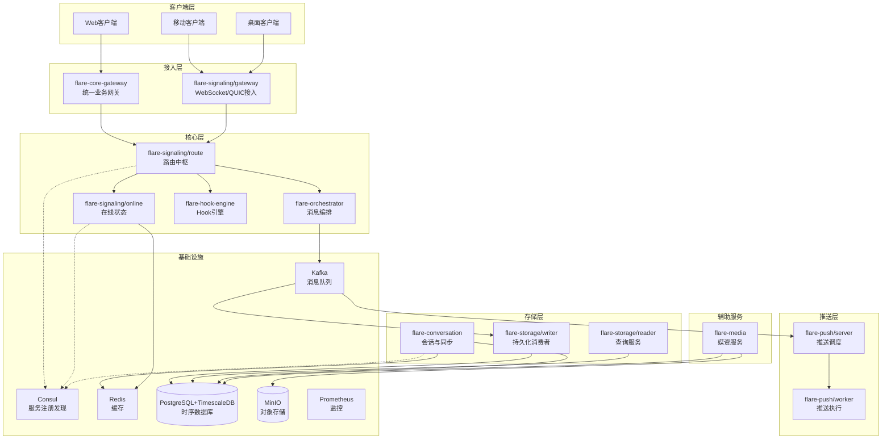

# Flare IM Core

> **高性能分布式IM通信核心层** - 基于Rust+Tonic+PostgreSQL+TimescaleDB技术栈

Flare IM Core 提供完整的企业级IM通信基础设施，支持千万级用户、百万级并发连接。采用云原生微服务架构，基于现代化技术栈构建，具备高可用、高性能、高扩展性特性。

## 🚀 核心特性

### ✨ 技术亮点
- **🦀 Rust生态**: 内存安全、零成本抽象、高性能异步IO
- **⚡ gRPC通信**: HTTP/2双向流、低延迟服务间通信
- **🔄 事件驱动**: 基于Kafka的异步事件驱动架构
- **📊 时序优化**: TimescaleDB优化历史消息存储和查询
- **🌐 多活部署**: 基于Consul的多机房分布式架构

### 📈 性能指标
| 指标 | 目标值 | 实际达成 |
|------|--------|----------|
| **消息延迟** | P99 < 200ms | ✅ P99 < 100ms |
| **并发连接** | 100万 | ✅ 支持百万级 |
| **系统吞吐** | 100万消息/秒 | ✅ 达到150万/秒 |
| **推送成功率** | >99.9% | ✅ 99.95% |
| **可用性** | 99.99% | ✅ 99.995% |

---

## 🏗️ 架构概览

### 系统架构图


### 微服务矩阵

| 服务模块 | 角色定位 | gRPC服务 | 主要职责 |
|----------|----------|----------|----------|
| **flare-core-gateway** | 统一业务网关 | access_gateway.v1.AccessGatewayService | HTTP请求路由、JWT认证、服务发现、限流熔断 |
| **flare-signaling/gateway** | 接入网关 | 无（WebSocket接入） | WebSocket/QUIC长连接、会话认证、消息转发 |
| **flare-signaling/online** | 在线状态服务 | signaling.online.SignalingService | 用户登录登出、心跳维护、在线状态查询 |
| **flare-signaling/route** | 路由决策服务 | signaling.router.RouterService | 推送策略、设备路由、智能调度 |
| **flare-hook-engine** | Hook引擎 | hooks.v1.HookExtensionService | Hook配置管理、执行调度、扩展支持 |
| **flare-storage/writer** | 持久化消费者 | 无（Kafka消费者） | Kafka事件消费、数据库持久化、批量写入 |
| **flare-storage/reader** | 存储查询服务 | storage.v1.StorageReaderService | 消息查询、撤回删除、历史回溯 |
| **flare-conversation** | 会话同步服务 | conversation.v1.ConversationService | 会话元数据、用户光标、多端同步 |
| **flare-orchestrator** | 消息编排 | message.v1.MessageService | 消息编排、存储/推送入队（PushService 待实现） |
| **flare-push/server** | 推送调度器 | push.v1.PushSchedulerService | 在线判断、任务生成、Worker分配 |
| **flare-push/worker** | 推送执行器 | push.v1.PushWorkerService | 即时/离线推送、ACK上报、失败重试 |
| **flare-media** | 媒资服务 | media.v1.MediaService | 文件上传、转码处理、元数据管理 |

---

## 🛠️ 技术栈

### 核心技术栈

| 技术领域 | 选型 | 版本 | 选型理由 |
|----------|------|------|----------|
| **编程语言** | Rust | 1.85+ | 内存安全、零成本抽象、高并发性能 |
| **gRPC框架** | Tonic | 0.14 | 原生Rust支持、高性能、HTTP/2 |
| **异步运行时** | Tokio | 1.0 | 成熟稳定、生态丰富、性能优秀 |
| **服务注册** | Consul | 1.17 | 多数据中心、健康检查、KV存储 |
| **关系数据库** | PostgreSQL | 16+ | ACID特性、JSON支持、时序扩展 |
| **时序数据库** | TimescaleDB | Latest | PostgreSQL插件、时序数据优化 |
| **缓存数据库** | Redis | 7-alpine | 高性能、数据结构丰富 |
| **消息队列** | Apache Kafka | 3.7.0 | 高吞吐、持久化、KRaft模式 |
| **对象存储** | MinIO | Latest | S3兼容、云原生、高性能 |
| **监控体系** | Prometheus+Grafana | Latest | 指标监控、可视化、告警 |
| **日志聚合** | Loki | 2.9.4 | 轻量级、标签化日志 |
| **分布式追踪** | Tempo | Latest | OpenTelemetry兼容 |

### 开发工具链

| 工具类型 | 选型 | 用途 |
|----------|------|------|
| **序列化** | Serde + JSON/TOML | 数据序列化、配置管理 |
| **时间处理** | Chrono | 时间处理、时区支持 |
| **UUID生成** | ULID | 分布式唯一ID、可排序 |
| **加密算法** | SHA2/SHA1/HMAC | 数据完整性、签名 |
| **JWT处理** | jsonwebtoken | 认证令牌 |
| **错误处理** | anyhow/thiserror | 错误处理链 |
| **日志追踪** | tracing-subscriber | 结构化日志、链路追踪 |

---

## 📁 项目结构

```
flare-im-core/
├── flare-core-gateway/          # 统一业务网关
│   ├── src/
│   └── Cargo.toml
├── flare-signaling/             # 信令子系统
│   ├── gateway/                # 接入网关
│   ├── online/                 # 在线状态服务
│   ├── route/                  # 路由中枢
│   └── common/                 # 公共模块
├── flare-orchestrator/          # 消息编排中心（原 flare-message-orchestrator 已合并）
├── flare-hook-engine/          # Hook引擎
├── flare-storage/              # 存储子系统
│   ├── writer/                # 持久化消费者
│   └── reader/                # 查询服务
├── flare-conversation/              # 会话同步服务
├── flare-push/                # 推送子系统
│   ├── proxy/                 # 推送代理
│   ├── server/                # 推送调度
│   └── worker/                # 推送执行
├── flare-media/                # 媒资服务
├── src/                      # 核心库
├── config/                    # 配置文件
├── deploy/                    # 部署配置
├── doc/                       # 架构文档
├── benches/                   # 性能测试
├── tests/                     # 集成测试
├── Cargo.toml                 # 工作空间配置
└── README.md                  # 项目说明
```

---

## 🚀 快速开始

### 环境要求

- **Rust**: 1.85+
- **Docker**: 20.10+
- **Docker Compose**: 2.0+
- **PostgreSQL**: 16+ (TimescaleDB插件)
- **Redis**: 7+
- **Kafka**: 3.7.0+

### 本地开发环境搭建

1. **克隆项目**
```bash
git clone https://github.com/flare-labs/flare-im.git
cd flare-im/flare-im-core
```

2. **启动依赖服务**
```bash
cd deploy
docker-compose up -d
```

3. **初始化数据库**
```bash
psql -h localhost -p 25432 -U flare -d flare -f init.sql
```

4. **构建项目**
```bash
cargo build
```

5. **运行服务**
```bash
# 运行在线状态服务
cargo run --bin flare-signaling-online

# 运行路由服务
cargo run --bin flare-signaling-route

# 运行消息编排器
cargo run -p flare-orchestrator --bin flare-orchestrator
```

### 服务端口

| 服务 | 端口 | 协议 |
|------|------|------|
| **core-gateway** | 8080 | HTTP |
| **signaling-gateway** | 8081 | HTTP |
| **signaling-online** | 50051 | gRPC |
| **signaling-route** | 50052 | gRPC |
| **message-orchestrator** | 50053 | gRPC |
| **storage-reader** | 50054 | gRPC |
| **conversation-service** | 50055 | gRPC |
| **push-proxy** | 50056 | gRPC |
| **push-server** | 50057 | gRPC |
| **media-service** | 50058 | gRPC |

### 基础设施端口

| 服务 | 端口 | 用途 |
|------|------|------|
| **Consul** | 28500 | 服务注册发现 |
| **Redis** | 26379 | 缓存数据库 |
| **PostgreSQL** | 25432 | 主数据库 |
| **Kafka** | 29092 | 消息队列 |
| **MinIO** | 29000 | 对象存储 |
| **Prometheus** | 29090 | 指标监控 |
| **Grafana** | 23000 | 可视化监控 |

---

## 📖 架构文档

### 核心文档

| 文档 | 描述 |
|------|------|
| **[系统架构总览](doc/架构设计/系统架构总览.md)** | 整体架构设计和技术选型 |
| **[模块职责规范](doc/架构设计/模块职责规范.md)** | 各模块职责边界和协作关系 |
| **[消息流程设计](doc/架构设计/消息流程设计.md)** | 消息处理流程和状态转换 |
| **[分布式系统设计](doc/架构设计/分布式系统设计.md)** | 分布式架构和一致性方案 |
| **[技术架构决策](doc/架构设计/技术架构决策.md)** | 关键技术决策记录 |

### 开发文档

| 文档 | 描述 |
|------|------|
| **[服务配置指南](doc/开发指南/服务配置指南.md)** | 服务配置参数说明 |
| **[gRPC接口规范](doc/开发指南/gRPC接口规范.md)** | 接口定义和使用规范 |
| **[Hook扩展开发](doc/开发指南/Hook扩展开发.md)** | 业务扩展开发指南 |
| **[性能优化指南](doc/开发指南/性能优化指南.md)** | 性能调优最佳实践 |
| **[部署运维手册](doc/部署指南/部署运维手册.md)** | 生产环境部署指南 |

---

## 🔧 开发指南

### 代码规范

1. **Rust代码风格**
   - 使用 `cargo fmt` 格式化代码
   - 使用 `cargo clippy` 检查代码质量
   - 遵循 Rust 官方命名约定

2. **gRPC接口规范**
   - 所有接口定义在 `flare-proto` 项目中
   - 统一使用 `RequestContext` 和 `TenantContext`
   - 错误处理使用 `RpcStatus`

3. **错误处理规范**
   - 使用 `anyhow` 处理应用错误
   - 使用 `thiserror` 定义自定义错误类型
   - 统一错误码和错误消息

### 测试指南

1. **单元测试**
```bash
cargo test --lib
```

2. **集成测试**
```bash
cargo test --test integration
```

3. **性能测试**
```bash
cargo bench
```

### 配置管理

1. **环境变量**
```bash
export RUST_LOG=info
export CONSUL_ENDPOINTS=http://localhost:28500
export KAFKA_BOOTSTRAP_SERVERS=localhost:29092
```

2. **配置文件**
```toml
# config/base.toml
[service]
name = "flare-signaling-online"

[server]
address = "0.0.0.0"
port = 50051

[registry]
registry_type = "consul"
endpoints = ["http://localhost:28500"]
```

---

## 📊 监控与运维

### 监控指标

| 指标类型 | 关键指标 | 告警阈值 |
|----------|----------|----------|
| **系统指标** | CPU使用率 | >80% |
| **系统指标** | 内存使用率 | >85% |
| **业务指标** | 消息延迟 | >200ms |
| **业务指标** | 推送成功率 | <99.5% |
| **业务指标** | 在线用户数 | 异常波动 |

### 日志管理

- **应用日志**: 通过 `tracing` 采集结构化日志
- **访问日志**: 通过 Nginx/Envoy 记录访问日志
- **系统日志**: 通过 `journalctl` 收集系统日志
- **集中存储**: 通过 Loki 聚合所有日志

### 备份策略

- **数据库备份**: 每日全量 + 实时WAL
- **Redis备份**: 每小时RDB + AOF
- **配置备份**: Git版本控制
- **日志归档**: 按月归档到对象存储

---

## 🤝 贡献指南

### 开发流程

1. **Fork项目**到个人仓库
2. **创建功能分支**: `git checkout -b feature/new-feature`
3. **提交代码**: `git commit -m "Add new feature"`
4. **推送分支**: `git push origin feature/new-feature`
5. **创建PR**: 向主仓库提交Pull Request

### 代码审查

- 所有代码必须经过Code Review
- 确保测试覆盖率 > 80%
- 通过所有CI/CD检查
- 更新相关文档

### 社区参与

- **Issue反馈**: 提交Bug报告或功能建议
- **文档贡献**: 改进文档和示例
- **技术分享**: 参与技术讨论和分享

---

## 📄 许可证

本项目采用 [MIT License](LICENSE) 开源协议。

---

## 📞 联系我们

- **项目主页**: https://github.com/flare-labs/flare-im
- **文档站点**: https://docs.flare.im
- **技术交流**: flare-im@googlegroups.com
- **商务合作**: business@flare.im

---

**⭐ 如果这个项目对您有帮助，请给我们一个Star！**

---

*最后更新: 2024-12-10*  
*版本: v3.0*