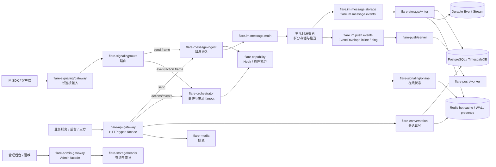
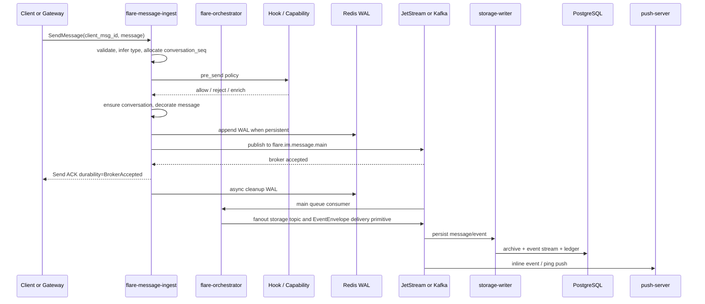

# Flare IM Core

[](LICENSE)
[](https://www.rust-lang.org/)


Flare IM Core 是 Flare IM 的服务端通信核心工作区，负责消息编排、会话同步、在线状态、信令路由、存储读写、推送、媒资与能力扩展。它面向生产级 IM 场景设计，保持业务中立：用户、好友、群资料、业务权限和产品规则由业务系统或插件提供，Core 只消费清晰的身份、会话、成员、Hook 与能力合同。


## 核心亮点

- 业务中立 IM Core：只承载消息、会话、seq、sync、push、presence、media、hook、capability 等通用能力。
- DDD + CQRS：领域层维护不变量，Command 路径负责写入，Query/Projection 路径服务读模型。
- 事件驱动：JetStream/Kafka 作为消息、存储、推送、会话事件的异步边界，避免接入层与存储层强耦合。
- 面向不丢主链消息：持久消息经过服务端消息 ID、客户端幂等 ID、会话 seq、发送侧 WAL、broker ack、存储幂等、写入 ledger 与 ACK 发布。
- 低延迟发送体验：发送 API 默认在 broker accepted 边界返回 ACK，存储与推送异步完成，客户端通过 durability 与后续 sync/ack 收敛。
- 插件化能力：Hook、Capability、RTC/SFU、风控、审核、机器人等通过端口、gRPC/Webhook、本地能力或插件扩展，不成为 Core 的硬依赖；生产主链 Hook 推荐使用 gRPC transport。
- 服务间 typed gRPC 优先：业务系统在可信内网调用消息、会话、媒体、在线状态等高频能力时，推荐使用 typed gRPC；HTTP/OpenAPI 主要作为外部三方、管理后台、低频后台和临时适配 facade。
- 可观测与可运维：tracing、Prometheus、Grafana、Loki、Tempo、message write ledger、MQ retry/DLQ topic 为生产排障提供边界。

## 架构总览



### 工作区服务与模块

| 服务/模块 | 定位 |
|------|------|
| `flare-api-gateway` | 面向业务系统和第三方的 HTTP API，做协议适配、认证上下文、错误映射，不写 IM 状态。 |
| `flare-admin-gateway` | 面向管理面和审计查询的 Admin API。 |
| `flare-signaling/gateway` | 客户端长连接接入、上行 frame 转发、下行推送、连接质量。 |
| `flare-signaling/route` | 设备路由、跨网关路由、推送策略。 |
| `flare-signaling/online` | 在线状态、设备连接、presence 查询。 |
| `flare-message-ingest` | 上行消息发送入口，负责发送校验、Pre/PostSend Hook、seq、WAL、会话确保与写入主消息流。 |
| `flare-orchestrator` | 主消息流 fanout、消息操作事件执行、RTC/capability 事件 enrich。 |
| `flare-sync-orchestrator` | 基于 conversation seq/event stream 的同步编排。 |
| `flare-storage/writer` | 消费存储 topic，完成幂等、归档、事件流、热缓存、ledger、ACK。 |
| `flare-storage/reader` | 消息、事件、审计和历史读模型查询。 |
| `flare-conversation` | 会话、参与者、游标、未读和会话同步读模型。 |
| `flare-call` | 通话会话生命周期、业务 FSM 和 CQRS 命令处理；不承载长连接路由或媒体/SFU 控制。 |
| `flare-push/server` | 消费推送 topic，区分在线/离线推送任务。 |
| `flare-push/worker` | 执行离线推送任务和重试。 |
| `flare-push/proxy` | 推送代理与边界适配。 |
| `flare-capability` | Hook、能力发现、授权、RTC/SFU 等扩展能力。 |
| `flare-im-capability-core` | 能力/插件共享契约：dispatch DTO、guard/resolver/RTC 端口、extension operation handler；不包含服务运行时。 |
| `flare-media` | 上传、对象存储、媒体处理、引用计数。 |

## 持久消息发送链路



持久消息的成功 ACK 默认表示 broker accepted，而不是已经落库。调用方必须读取 `SendAckDurability`：

持久会话消息的实时下行统一走 `flare.im.push.events`：小会话/单聊使用
`EVENT_MESSAGE + PING_WITH_INLINE` 作为延迟优化，大群或 inline 泄压阀关闭时使用
recipient-less `PING`，由 Push Server 分页解析成员并只对在线用户发送 ping。
10 万人大群的高频消息在 Push Server 解析成员前按 `(tenant_id, conversation_id)` 合并水位：
首个 ping 立即触达，窗口内后续 ping 只保留最高 `max_conversation_seq` 并发送 trailing ping，
客户端按水位拉取补齐，避免每条消息都扫描 10 万成员。
`flare.im.push.messages` 仅保留给非持久或直接 push-only 消息入口。

| durability | 含义 | 适用场景 |
|------------|------|----------|
| `TRANSIENT_ACCEPTED` | 仅实时投递路径接受，不承诺离线/存储恢复。 | typing、临时通知、`persistent=false` 通知。 |
| `WAL_ACCEPTED` | 已进入发送侧 WAL，可由恢复任务重放。 | 预留语义。 |
| `BROKER_ACCEPTED` | 已被主消息队列接受，存储与推送可异步恢复。 | 当前持久消息默认成功边界。 |
| `PERSISTED` | 已提交存储，可作为立即查询/同步水位。 | 同步持久发送目标，当前发送接口未默认实现。 |

## 消息与通知规则

Core 使用强类型 `MessageContent` 和 `Event` 表达稳定语义，`attributes`/`extensions` 只作为业务扩展。

| 类别 | 示例 | 是否分配 seq | 是否写 WAL | 是否持久化 | 是否离线恢复 |
|------|------|--------------|------------|------------|--------------|
| 普通消息 | text、image、file、rich_text、custom | 是 | 是 | 是 | 是 |
| 系统消息 | group.member_joined、member_removed | 是 | 是 | 是 | 是 |
| 操作事件 | recall、edit、delete、read、reaction、pin、mark | 是 | 是 | 是 | 是 |
| 持久通知 | `NotificationContent.persistent = true` | 是 | 是 | 是 | 是 |
| 临时通知 | `NotificationContent.persistent = false` | 否或不作为历史水位 | 否 | 否 | 否 |
| 临时状态 | typing、presence、system_event | 否 | 否 | 否 | 否 |

## 技术栈

| 领域 | 选型 |
|------|------|
| 语言与运行时 | Rust 2024 edition、Tokio |
| RPC | Tonic gRPC、Protobuf (`flare-proto` / `flare-grpc-proto`) |
| HTTP API | Axum、utoipa OpenAPI |
| 业务系统接入 | gRPC Hook + typed gRPC；HTTP/OpenAPI 作为 facade |
| MQ | NATS JetStream 默认，本地也拉起 Kafka；生产同链路二选一 |
| 存储 | PostgreSQL / TimescaleDB、SQLx |
| 缓存与状态 | Redis |
| 对象存储 | S3 兼容存储，本地 RustFS |
| 发现与配置 | Consul 默认，可扩展到 etcd/mesh |
| 观测 | tracing、Prometheus、Grafana、Loki、Tempo |

## 快速开始

```bash
cd deploy
docker compose up -d

cd ..
make start-core
# 已编译过、日常联调可跳过 build：
# make start-core-fast
```

业务中立模式使用 `config/hooks.core.toml`。如果要接入业务系统的好友/群权限校验，请先启动业务系统 Hook 服务，并将 `config/hooks.toml` 指向对应的业务系统 Hook 配置。生产环境推荐业务系统 Hook 使用 gRPC transport（`type = "grpc"`），高频服务间调用使用 typed gRPC。

常用验证：

```bash
cargo test --workspace
cargo run -p flare-im-core --example perf_message_send
make stop   # 停止全部 Core 服务
```

编译内存紧张时可限制并行度：`CARGO_BUILD_JOBS=2 make start-core`。启动失败时查看 `logs/cargo-build.log` 与各服务 `logs/flare-*.log`。

## 当前性能读数

以下为本地开发环境集成压测的一次参考结果，不是生产 SLA：

| 场景 | 发送量 | 成功 | ACK 吞吐 | P95 ACK 延迟 | 存储丢失观测 |
|------|--------|------|----------|--------------|--------------|
| 单会话 64B | 1000 | 1000 | 318.46 ACK/s | 178.856 ms | 0 |
| 多会话 64B | 3000 | 3000 | 179.45 ACK/s | 570.038 ms | 0 |
| 多会话 1KB | 1000 | 1000 | 157.95 ACK/s | 1158.081 ms | 0 |

这次压测使用 dev build，并受到离线推送后端未配置导致的重投递影响。生产容量需要 release build、独立写路径/推送路径压测和连接池调优后重新确认。

## 设计约束

- Core 不保存业务用户资料、好友关系或群资料。
- Core 不把稳定协议语义重复写进 `metadata`、`attributes` 或 `extensions`。
- 业务权限通过认证上下文、Hook、Capability、业务系统 Bridge 或业务服务实现。
- 业务系统主链 Hook 推荐使用 gRPC transport；可信内网高频服务间调用推荐使用 typed gRPC。
- 持久消息与临时消息的可靠性承诺必须分开描述。
- 所有跨服务写路径优先采用 command -> domain -> event/MQ -> consumer/projection。
