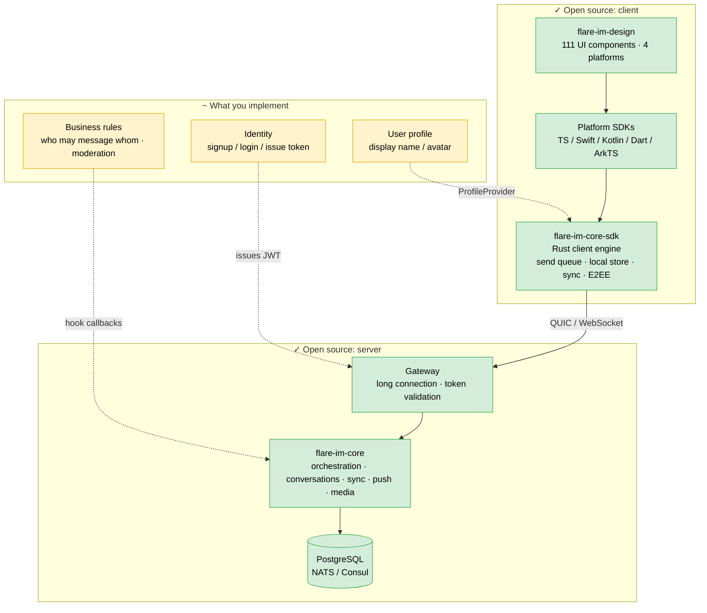
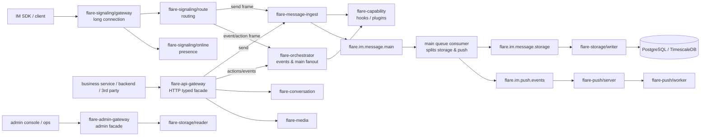

# Flare IM Core

**English** · [中文](./README.zh-CN.md)

**Self-hosted, production-grade IM backend.** Reliable message delivery, multi-device
sync, offline push, end-to-end encryption — the parts you would rather not write
again, already written and auditable.

```bash
git clone … && cd flare-im-core
docker compose -f deploy/docker-compose.yml up -d
./scripts/start_server.sh && ./scripts/smoke_opensource.sh
```

```
✓ Open-source stack is self-sufficient: 6/6 passed (no commercial components involved)
```

That last command runs six real end-to-end cases (send + persist, event bus, full
operation surface, unread regression, RTC room join, end-to-end encryption). Exit code 0
means all passed — you don't have to read the docs first to find out whether it works.

The same suite runs against a full stack every night in CI (the Nightly E2E badge below).
So "6/6 passed" is not a screenshot from one lucky run; it is a claim that gets
re-verified daily.

[](https://github.com/flare-im/flare-im-core/actions/workflows/nightly-e2e.yml)
[](LICENSE)
[](https://www.rust-lang.org/)


> **Getting started**: [QUICKSTART.md](./QUICKSTART.md) (five minutes, ends with a
> self-check) → [INTEGRATION.md](./INTEGRATION.md) (wire it into your own product:
> identity, clients, deployment, E2EE)

## Why use it

- **Messages don't get lost.** Server message ID + client idempotency ID + per-conversation
  seq + send-side WAL + broker ack + storage idempotency + write ledger. Every hop leaves a
  trace you can query — this is not "trust us, it's reliable".
- **Sending doesn't block.** The ACK returns at the broker-accepted boundary; storage and
  push converge asynchronously. Users wait for enqueue, not for fsync.
- **E2EE you can actually demo.** `cargo run --example e2ee_demo` prints, on the spot, that
  the server only ever sees 323 bytes of ciphertext, that the plaintext never leaked, and
  that a third party fails to decrypt.
- **Self-hostable and auditable.** Rust, Apache-2.0, protocol and core both in the repo —
  not a box you can only trust.
- **6 platform SDKs + 111 UI components.** TypeScript (shared by Web / Tauri / Electron),
  Swift, Kotlin, Dart, HarmonyOS ArkTS / Cangjie — all generated from one `sdk-spec`.

## Where does my code go



**Green is ready to use; the three yellow boxes are yours to wire.** Only "issue a token"
is mandatory — skip the other two and it still runs, you just won't have display names or
send-permission checks. See [INTEGRATION.md](./INTEGRATION.md).

## On the boundary: no identity system included

The yellow boxes above are a deliberate split, not an omission. Every product's identity
system looks different; bundling one would be a burden rather than a gift.

The **authentication contract itself is fully open source**. Two routes:

- **`CoreJwtTokenValidator`** — validate JWT locally. Sign a token by hand and you can run
  a demo or PoC with no identity system at all.
- **`HttpHookTokenValidator`** — POST the token to your own endpoint. This is the entry
  point for plugging in your existing users.

Business rules work the same way: nine hook extension points live in
`crates/flare-im-hooks` (PreSend / PostSend / Delivery / Recall / MessageRead /
MessageReaction / ConversationLifecycle / ConversationMember / GetConversationParticipants).

This is the same "bring your own identity" model as Sendbird or Twilio Conversations —
the difference being that Flare is self-hostable and its protocol and core are auditable.
Details in [GOVERNANCE.md](GOVERNANCE.md).

## Service topology



## Design principles

- **Business-neutral core.** Only messaging, conversations, seq, sync, push, presence,
  media, hooks and capabilities. Users, friends, group metadata and product rules come from
  your systems or plugins.
- **DDD + CQRS.** The domain layer holds invariants; the command path writes, the
  query/projection path serves reads.
- **Event-driven.** JetStream/Kafka is the asynchronous boundary between messaging, storage,
  push and conversation events, so the ingress layer never couples to storage.
- **Typed gRPC between services.** HTTP/OpenAPI exists for external parties, admin consoles
  and low-frequency backends — not for the hot path.
- **Observable.** tracing, Prometheus, Grafana, Loki, Tempo, message write ledger, MQ
  retry/DLQ topics.

## Documentation

| Document | What it answers |
|---|---|
| [QUICKSTART.md](./QUICKSTART.md) | Get it running in five minutes and prove it works |
| [INTEGRATION.md](./INTEGRATION.md) | Wire it into your product: identity, clients, deployment, E2EE |
| [GOVERNANCE.md](GOVERNANCE.md) | What is open source, what is commercial, and why |
| [CONTRIBUTING.md](CONTRIBUTING.md) | How to contribute |
| [SECURITY.md](SECURITY.md) | Reporting vulnerabilities |

中文文档：[README](./README.zh-CN.md) · [QUICKSTART](./QUICKSTART.zh-CN.md) ·
[INTEGRATION](./INTEGRATION.zh-CN.md)

## When you need identity and social features

Friends, group governance and moments are available as a commercial layer speaking the
same protocol — the interfaces above do not change. See [GOVERNANCE.md](GOVERNANCE.md).

## License

Apache-2.0. Commercial use and closed-source distribution are both fine; keep the
copyright notice.
