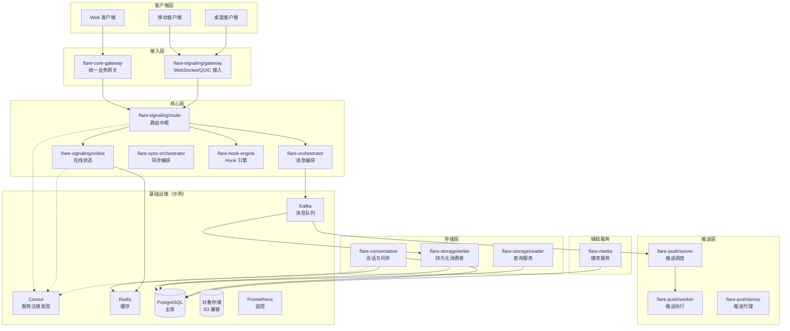

# Flare IM Core

> **IM 服务端通信核心层（Rust 工作区）** — 基于 Tonic、gRPC、Kafka、PostgreSQL 等组件的微服务集合，与 `flare-im` 单仓内 `flare-proto`、`flare-server-core`、`flare-im-core-sdk`（客户端 SDK）等协同演进。

Flare IM Core 提供接入、信令、消息编排、存储读写、会话同步、推送与媒资等能力；本地开发依赖 Docker Compose 拉起 Consul、Redis、Kafka、PostgreSQL 等基础设施。具体行为以本仓库源码与 `deploy/` 配置为准。

## 核心特性

### 技术亮点

- **Rust 工作区**：统一 `edition = "2024"`、`rust-version = "1.94.0"`（见根 `Cargo.toml`）
- **gRPC**：服务间 HTTP/2，接口定义见上级目录 `flare-proto` / `flare-grpc-proto`
- **事件驱动**：Kafka 串联编排、存储写入与推送等链路
- **存储**：PostgreSQL（含时序场景扩展能力，以实际库表与 `flare-storage` 为准）
- **服务发现**：与 `flare-server-core` / `flare-im-core` 发现模块配合，本地 `deploy` 默认 Consul（亦可按配置对接 etcd 等后端）

### 容量与体验方向

以下为产品与架构演进方向，**非固定 SLA**；线上指标以各自监控与压测为准。

| 维度 | 方向 |
|------|------|
| 消息延迟 | 接入、路由、存储分段优化，目标低延迟 |
| 并发连接 | 接入层与在线服务可水平扩展 |
| 吞吐 | Kafka 解耦 + 存储批量写入 |
| 可用性 | 多实例部署、健康检查与注册发现 |

---

## 架构概览

### 系统架构图（逻辑）



### 微服务矩阵（工作区成员）

| 服务模块 | 角色定位 | 说明 |
|----------|----------|------|
| **flare-core-gateway** | 统一业务网关 | HTTP 接入、鉴权、路由到后端 gRPC |
| **flare-signaling/gateway** | 信令接入 | WebSocket 等长连接 |
| **flare-signaling/online** | 在线状态 | 登录登出、心跳、在线查询 |
| **flare-signaling/route** | 路由 | 设备路由、推送策略等 |
| **flare-orchestrator** | 消息编排 | 消息入队、与存储/推送协作 |
| **flare-sync-orchestrator** | 同步编排 | 多端会话与同步相关编排（见 crate 内实现） |
| **flare-hook-engine** | Hook 引擎 | 扩展点调度与执行 |
| **flare-storage/writer** | 持久化 | Kafka 消费、写库 |
| **flare-storage/reader** | 查询 | 消息查询、历史等 |
| **flare-conversation** | 会话 | 会话元数据、光标与同步 |
| **flare-push/proxy** | 推送代理 | 推送链路代理能力 |
| **flare-push/server** | 推送调度 | 任务生成与 Worker 协调 |
| **flare-push/worker** | 推送执行 | 实际下发与重试 |
| **flare-media** | 媒资 | 上传与媒体相关能力 |

> gRPC 服务名与 `.proto` 以 `flare-proto` / 各服务 `build.rs` 为准。

### 与单仓其他目录的关系

| 路径（相对 `flare-im` 根） | 说明 |
|---------------------------|------|
| `flare-proto` / `flare-grpc-proto` | 协议与生成代码 |
| `flare-server-core` | 服务端运行时、发现、MQ 等公共能力 |
| `flare-core` | 共享核心库 |
| `flare-im-core-sdk` | 客户端 SDK（Rust / C FFI / 示例应用等） |

---

## 技术栈（摘要）

| 领域 | 选型 | 备注 |
|------|------|------|
| 语言 | Rust 1.94+ | 与工作区 `rust-version` 对齐 |
| gRPC | Tonic 0.14 | HTTP/2 |
| 异步 | Tokio | 各服务主运行时 |
| 消息队列 | rdkafka / Kafka | 以配置为准 |
| 数据库 | SQLx + PostgreSQL | 各服务独立连接配置 |
| 缓存 | Redis | 在线、会话等 |
| 发现 | Consul（本地 compose）/ 可扩展 | 见 `flare-im-core` `discovery` 与 `doc/` |

---

## 项目结构

```
flare-im-core/                    # 本 README 所在工作区根
├── flare-core-gateway/
├── flare-signaling/
│   ├── gateway/
│   ├── online/
│   ├── route/
│   └── common/
├── flare-orchestrator/
├── flare-sync-orchestrator/      # 同步编排服务
├── flare-hook-engine/
├── flare-storage/
│   ├── writer/
│   └── reader/
├── flare-conversation/
├── flare-push/
│   ├── proxy/
│   ├── server/
│   └── worker/
├── flare-media/
├── src/                          # 公共库 flare_im_core（配置、发现、领域端口等）
├── deploy/                       # Docker Compose 与本地依赖
├── doc/                          # 架构与流程文档
├── benches/
├── tests/
├── Cargo.toml                    # workspace 定义
└── README.md
```

---

## 快速开始

### 环境要求

- **Rust**：**1.94.0** 及以上（与 `[workspace.package]` 一致）
- **Docker / Docker Compose**：用于 `deploy/docker-compose.yml`
- **PostgreSQL、Redis、Kafka 等**：由 Compose 拉起或自行提供对等实例

### 本地开发

1. **进入工作区**（在 `flare-im` 单仓内）

```bash
cd flare-im/flare-im-core
```

2. **启动依赖**（示例）

```bash
cd deploy
docker compose up -d
```

3. **数据库初始化**  
以 `deploy/db/` 与团队约定脚本为准（端口、库名见 compose 与环境变量）。

4. **构建**

```bash
cargo build
```

5. **运行示例二进制**（按需选择包名）

```bash
cargo run -p flare-signaling-online --bin flare-signaling-online
cargo run -p flare-signaling-route --bin flare-signaling-route
cargo run -p flare-orchestrator --bin flare-orchestrator
cargo run -p flare-sync-orchestrator --bin flare-sync-orchestrator
```

具体监听端口与配置项见各服务 `config` 或 `deploy` 内示例。


## 开发指南

### 代码规范

- `cargo fmt`、`cargo clippy`
- gRPC / 错误模型与 `flare-proto`、`flare-server-core` 保持一致

### 测试

```bash
cargo test --workspace
# 单包示例
cargo test -p flare-im-core --lib
```

### 配置

- 日志：`RUST_LOG`（如 `info`）
- 注册中心、Kafka、数据库等以各服务加载的 TOML / 环境变量为准（参见 `doc/配置管理方案.md`）

---

## 监控与运维（概要）

- **指标**：各服务可暴露 Prometheus 指标（以实际 `metrics` 模块为准）
- **日志**：`tracing` 结构化输出
- **部署**：生产参数由运维与 `deploy` 目录外层的编排方案定义

---

## 贡献指南

1. 在功能分支开发，提交前通过 `fmt` / `clippy` / 相关测试  
2. 协议变更需同步 `flare-proto` 并更新本文档或 `doc/` 中链接说明  
3. Code Review 与 CI 策略以组织规范为准  

---

## 许可证

许可证以根目录 `Cargo.toml` 中 `[workspace.package] license = "MIT"` 为准；若需单独分发 `LICENSE` 文本文件，请在发布流程中补充。

---

## 联系我们

- **邮件**：flare1522@163.com（技术交流、问题反馈）

---

若本仓库对你有帮助，欢迎 Star 与 PR。

---

*文档版本与仓库工作区版本对齐：`workspace.package.version`（当前 **0.1.0**）*  
*最近更新：2026-04-12*
