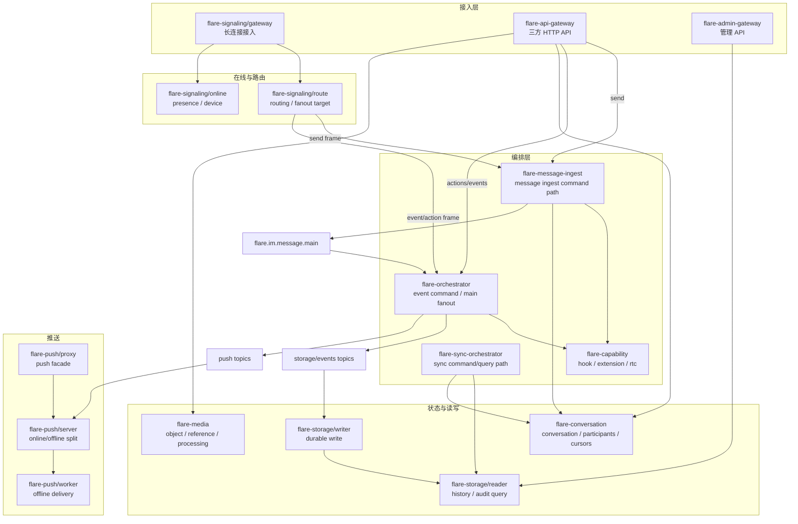

# 架构与技术栈总览

`flare-im-core` 是通信核心层，不是承载用户、好友、群等产品规则的业务系统，也不是单体聊天应用。它的核心职责是把“连接、消息、会话、同步、存储、推送、媒体和扩展能力”组织成清晰的服务边界，让业务方可以在不侵入 Core 的情况下接入用户、好友、群、权限、风控、审核和运营能力。

## 架构方向

- Transport agnostic：IM Core 不绑定 WebSocket、QUIC、HTTP 或某个客户端协议，长连接接入由 `flare-signaling/gateway` 和 `flare-core` 承担。
- Business neutral：用户资料、好友关系、群资料、业务规则不进入 Core，业务规则通过 Hook、Capability、业务系统 Bridge 或第三方服务接入。
- Event driven：跨服务写路径通过 MQ 和领域事件衔接，降低同步调用链长度。
- DDD + CQRS：领域层维护不变量，Command 负责状态变化，Query/Projection 负责读模型。
- Pluggable capability：SFU/RTC、机器人、审核、风控、外部业务扩展都通过能力合同接入。
- Production first：默认考虑幂等、租户隔离、顺序、重放、DLQ、trace、metrics 和运维边界。

## 与单仓其他模块的边界

| 模块 | 责任 | 不属于它的内容 |
|------|------|----------------|
| `flare-core` | transport frame、连接、心跳、协商、基础协议 | IM 消息业务语义 |
| `flare-server-core` | 运行时、上下文、错误、服务发现、MQ、auth 基础设施 | IM 领域规则或业务系统规则 |
| `flare-im-core` | message、conversation、seq、sync、push、hooks、capability、media | 好友关系、群资料、业务产品规则 |
| 业务系统 | 用户、好友、群目录、业务 BFF、业务系统到 IM Core 的 Bridge、业务 Hook | Core 持久化消息链路 |
| `flare-plugin` | 可选服务端能力，例如 SFU/WebRTC | Core 主链必需依赖 |
| `flare-im-core-sdk` | 客户端 IM 行为源头 | 服务端存储和业务规则 |
| `flare-im-core-client-sdk` | spec、codegen、平台 adapter 和示例 | 第二套 IM 行为实现 |

## 服务分层



## 接入与连接边界

客户端推荐只建立一条主长连接到 `flare-signaling/gateway`。这条连接由 `flare-core` 承载 frame、心跳、认证和传输协商，在连接内部用 typed frame / command 逻辑多路复用：

- 消息上行：`flare-signaling/gateway` 将 send frame 转发到 `flare-signaling/route`，再进入 `flare-message-ingest`。
- ACK / read / sync：在同一条长连接上承载对应 frame，服务端再转发到 route、conversation 或 sync-orchestrator。
- call / SFU 信令：`flare-call` 拥有通话会话生命周期和业务 FSM，`flare-capability` / 插件负责 RTC/SFU 资源编排，gateway 只做连接侧路由提示；真实音视频媒体流不进入 IM 消息主链。
- 能力/插件契约：`flare-im-capability-core` 是共享 contract 来源；`flare-capability` 只负责运行时注册、授权、路由和 gRPC 服务实现。
- 下行推送：push-server 通过 route/online 找到连接所在 gateway，由同一条长连接下发。

`flare-api-gateway` 不作为客户端长连接入口；它是业务系统、三方系统和低频后台调用 Core typed API 的 HTTP facade。`flare-admin-gateway` 只服务管理面、审计和运维查询。若未来需要 HTTP/2 或 QUIC multiplexed stream，应优先保持同一个客户端接入网关进程，并在 transport 内隔离逻辑 stream，而不是让 core/signaling/admin 三个网关同时暴露客户端 WebSocket。

鉴权统一由 `flare-server-core::auth::TokenValidator` 负责，网关只做传输适配：

- HTTP 网关使用 shared `gateway_auth` 注入 `user_id`、`tenant_id`、`device_id`、`app_id`。
- 长连接网关在 AUTH frame 阶段复用同一套 token validator，并把认证主体写入连接 metadata。
- JWT、本地 Core token、可信 issuer、外部 SSO/Hook 的选择属于 auth provider 配置，不属于每个 gateway 的私有实现。

## 写路径

持久消息写路径遵循：

```text
Send Command -> flare-message-ingest -> WAL -> MQ main -> flare-orchestrator fanout -> Storage/Projection/Push
```

关键原则：

- `flare-message-ingest` 是上行消息真源入口，负责校验、Hook、seq、conversation ensure、WAL 和写入主消息流。
- `flare-orchestrator` 不再承担上行消息发送，只消费 `TOPIC_MESSAGE_MAIN` 并做存储/推送 fanout；消息操作事件仍由 orchestrator 编排。
- `TOPIC_MESSAGE_MAIN` 是持久消息/事件的主入口。
- 主队列消费者把持久消息拆分到 `TOPIC_MESSAGE_CREATED` 和 `TOPIC_PUSH_EVENTS`；小会话使用 inline `EVENT_MESSAGE`，大群或泄压阀关闭时使用 recipient-less ping。
- `flare-storage/writer` 消费存储 topic，完成幂等、归档、事件流、热缓存、ledger 和 ACK。
- `flare-push/server` 消费推送 topic，按在线状态拆分在线投递和离线任务；大群 pure ping 在解析成员前按 `(tenant_id, conversation_id)` 合并水位，只投在线用户，离线靠 user_version/sync 兜底。

## 读路径

读路径不反向依赖写路径的应用服务：

- 历史消息和审计查询走 `flare-storage/reader`。
- 会话列表、成员、未读、游标走 `flare-conversation`。
- 通话会话生命周期和业务状态机走 `flare-call`，媒体控制面仍由 capability/plugin 承担。
- 多端同步走 `flare-sync-orchestrator`，基于 conversation seq 和 event stream 收敛。
- 在线状态走 `flare-signaling/online`。
- 媒体文件、引用、对象 ACL 走 `flare-media`。

## MQ topic 设计

| topic | 生产者 | 消费者 | 语义 |
|------|--------|--------|------|
| `flare.im.message.main` | `flare-message-ingest` / event action path | `flare-orchestrator` main consumer | 持久消息/事件主输入。 |
| `flare.im.message.storage` | main consumer | `flare-storage/writer` | 消息创建持久化。 |
| `flare.im.message.events` | main consumer / action path | `flare-storage/writer`、`flare-conversation` | 操作事件、会话事件、已读等。 |
| `flare.im.push.messages` | push-only/direct path | `flare-push/server` | 非持久或直接消息推送入口；持久会话消息不再依赖该 topic。 |
| `flare.im.push.events` | main consumer / push-only path | `flare-push/server` | 统一会话投递原语：`PING_WITH_INLINE` / `PING` / 操作事件实时投递。 |
| `flare.im.push.envelope` | orchestrator / push proxy | `flare-push/server` | ACK、通知、CustomData、系统推送信封。 |
| `flare.im.push.online` | `flare-push/server` | online push executor | 在线投递任务。 |
| `flare.im.push.offline` | `flare-push/server` | `flare-push/worker` | 离线推送任务。 |
| retry/DLQ topics | consumers | recovery tooling | 重试、终止和人工排障。 |

## 存储与状态

| 存储 | 用途 |
|------|------|
| PostgreSQL / TimescaleDB | 消息归档、事件流、会话、媒体、Capability、ledger、审计查询。 |
| Redis | 在线状态、会话热状态、发送侧 WAL、ACK 状态、缓存。 |
| NATS JetStream | 默认消息队列，本地开发与压测主路径。 |
| Kafka | 可选生产 MQ 后端，同链路与 JetStream 二选一。 |
| S3 compatible object store | 媒资对象、上传与下载 URL，本地使用 RustFS。 |

## 技术栈亮点

| 领域 | 选型 | 设计价值 |
|------|------|----------|
| Rust 2024 + Tokio | 异步服务和零成本抽象 | 高并发、低内存开销、明确错误边界。 |
| Tonic gRPC + Protobuf | 内部 typed RPC、gRPC Hook | 业务系统高频调用和主链 Hook 推荐协议，服务间合同明确，便于跨语言 SDK/codegen。 |
| Axum + utoipa | HTTP gateway | 外部三方、管理后台、低频后台和临时适配的 OpenAPI facade。 |
| JetStream / Kafka | MQ 抽象 | 解耦写入、推送、同步，支持重放和 DLQ。 |
| SQLx + PostgreSQL | 持久化 | 强一致写、索引查询、可审计。 |
| Redis | 热状态/WAL/ACK | 低延迟状态访问和短期恢复边界。 |
| Prometheus + tracing | 观测 | stage latency、MQ ack、写入 ledger、trace 排障。 |

## DDD/CQRS 落点

- Domain Model：消息类别、持久化模式、会话类型、事件类型、retention、seq。
- Domain Service：ingest 负责消息校验、seq 分配、WAL 写入；orchestrator 负责 push/persist fanout、事件校验、Capability enrich。
- Repository Port：WAL、Recipient、Push、Storage、Idempotency、Ledger、AckPublisher 按服务边界归属。
- Application Handler：gRPC/HTTP/MQ 命令编排，控制流程但不塞业务规则。
- Infrastructure Adapter：Redis、PostgreSQL、MQ、gRPC client、Webhook、object store。

## 关键边界

- Gateway 只做协议适配、身份上下文、限流、错误映射和 typed proxy。
- Orchestrator 是主消息流 fanout 和操作事件写路径中心，但不接收 `SendMessage`，也不拥有用户/好友/群业务数据。
- Storage Writer 是持久化一致性中心，但不负责路由和实时推送。
- Conversation 是会话读模型中心，不决定好友/群业务关系。
- Capability/Hook 是扩展点，不应成为每个消息都必须依赖的业务单体。

## 生产部署取舍

| 选择 | 推荐 | 原因 |
|------|------|------|
| MQ 后端 | JetStream 或 Kafka 二选一 | 避免同链路双写造成一致性和排障复杂度。 |
| ACK 边界 | 默认 broker accepted | 降低发送延迟，存储通过异步 ACK/sync 收敛。 |
| 强一致发送 | 只给明确需要的业务开放 | 会显著拉长延迟和尾部风险。 |
| Hook 策略 | 主链门禁推荐 gRPC Hook，短超时 fail-fast；旁路审计 ignore/retry | 控制业务扩展对核心链路的影响。 |
| 临时消息 | push-only | typing/presence 不占历史 seq，不承诺离线恢复。 |
