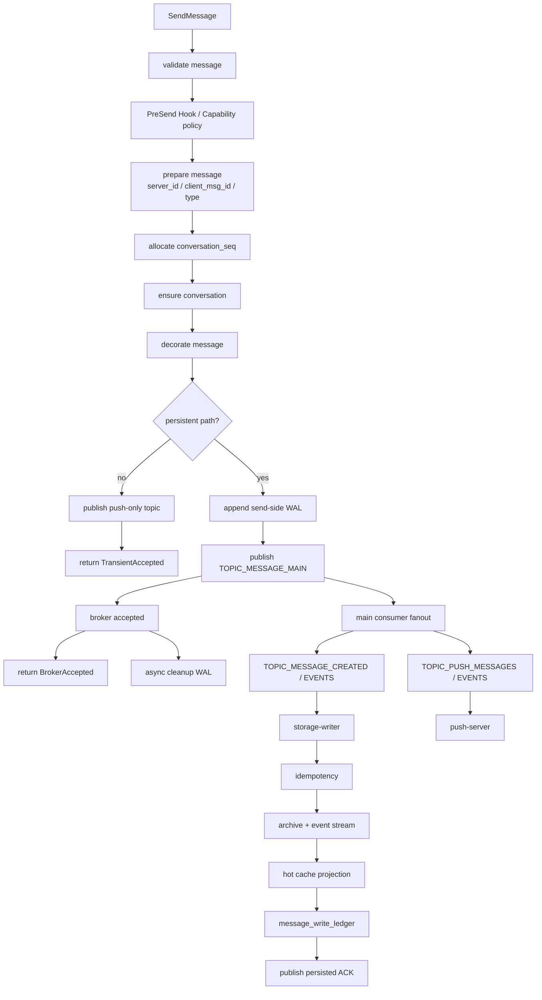

# 消息可靠性与低延迟链路

本文描述 Flare IM Core 当前持久消息链路如何追求 0 可观测丢失，以及它和低延迟发送体验之间的取舍。这里的“0 丢失”只适用于进入持久化路径的消息和事件，不适用于设计上就是临时的 push-only 消息。

## 可靠性合同

| 消息类别 | 可靠性目标 |
|----------|------------|
| 持久消息 | broker accepted 后必须可通过 MQ、WAL 重放、存储幂等和 ledger 收敛到持久化结果。 |
| 持久事件 | recall/edit/delete/read/reaction/pin/mark 等事件必须进入事件流和读模型。 |
| 持久通知 | `NotificationContent.persistent = true` 时按持久消息处理。 |
| 临时通知 | `persistent = false` 时只做在线触达，不承诺离线恢复。 |
| typing/presence/system_event | push-only，不写 WAL，不分配历史 seq，不持久化。 |

## 发送链路

## 为什么可以低延迟

发送 API 默认在 `BrokerAccepted` 返回。这样客户端不需要等待 PostgreSQL、读模型、离线推送和 ACK 归档全部完成。

低延迟策略：

- 上行 typed gRPC 只做必要校验、Hook、seq 和 MQ publish；业务系统高频写调用推荐直接走 typed gRPC。
- 持久化和推送并行 fanout。
- conversation_id 作为 MQ partition key/subject key，保证同会话顺序并减少跨会话互相阻塞。
- 存储 writer 负责批量、幂等和热缓存投影，避免发送请求同步等待。
- 主链业务 Hook 推荐使用 gRPC transport，并按 priority 和 error policy 控制影响；旁路审计类 Hook 使用短超时和 ignore/retry。
- metrics 记录 `validate`、`pre_send_hook`、`prepare_allocate_seq`、`conversation_ensure`、`decorate`、`wal_write`、`mq_publish`、`wal_cleanup`、`post_send_hook` 等阶段延迟。

## 如何保证持久消息不丢

### 1. 客户端与服务端双 ID

- `server_id`：服务端消息 ID，全局唯一。
- `client_msg_id`：客户端或业务方幂等 ID，重复发送时用于收敛。
- `x-request-id` / `Idempotency-Key`：HTTP/gateway 层请求幂等和排障关联。

### 2. 会话 seq

`conversation_seq` 是会话内 replay 和 sync 水位。它让客户端可以按 seq 拉取缺口，而不是依赖实时推送一定到达。

### 3. 发送侧 WAL

持久消息在进入主消息队列前先写 WAL。只要 WAL 未清理，恢复任务可以扫描 pending entry 并重放。

WAL 清理规则：

- broker accepted 后可以异步清理发送侧 WAL。
- 清理失败不让已被 broker 接受的发送变失败，只增加一次未来重放/去重成本。
- 重放时根据消息类型和 `NotificationContent.persistent` 决定是否继续走持久化路径。

### 4. Broker durable boundary

`TOPIC_MESSAGE_MAIN` 是持久消息主入口。发送 API 返回 `BrokerAccepted` 表示消息已跨过 broker durable boundary。后续存储和推送由消费者恢复。

生产配置要求：

- JetStream stream 使用 file storage、合理 duplicate window、ack wait、max deliver。
- Kafka 使用 `acks=all`、`enable.idempotence=true`、合理 `min.insync.replicas`。
- 同一链路不要 JetStream 和 Kafka 双写。

### 5. Storage Writer 幂等

`flare-storage/writer` 在持久化前做幂等：

- 优先用 `client_msg_id + sender_id` 去重。
- 退化到 `server_id` 去重。
- durable write 失败时释放预占坑，允许后续重试。
- 重复消息会发布 deduplicated ACK，调用方可收敛。

### 6. Archive + event stream

持久化不只是写消息表：

- archive store 写入消息归档。
- event stream 追加 `EVENT_MESSAGE` 或操作事件，供 sync/replay 使用。
- hot cache projection 失败只记录告警，不推翻 durable write。

### 7. Message write ledger

`message_write_ledger` 记录写入阶段，例如：

- storage persisted
- WAL cleaned
- WAL cleanup failed
- ACK published
- ACK publish failed

它是排查“已 ACK 但未出现在查询/同步中”的关键证据。

### 8. ACK 分层

`SendAckDurability` 不把所有成功混成一个布尔值。

| durability | 语义 |
|------------|------|
| `TRANSIENT_ACCEPTED` | 只进入实时投递路径，不能用来证明消息可恢复。 |
| `WAL_ACCEPTED` | 已进入发送侧 WAL。 |
| `BROKER_ACCEPTED` | 已进入主消息队列，当前持久消息默认发送成功边界。 |
| `PERSISTED` | 已提交存储，可立即作为查询/同步水位。 |

客户端或三方服务必须根据 durability 决定 UI 状态和后续检查方式。

## 失败场景与恢复

| 失败点 | 结果 | 恢复方式 |
|--------|------|----------|
| 校验失败 | 不写 WAL，不入队 | 返回结构化错误。 |
| PreSend Hook 拒绝 | 不写 WAL，不入队 | 返回业务拒绝。 |
| WAL 写失败 | 不入队 | 发送失败，客户端可用同一 `client_msg_id` 重试。 |
| MQ publish 失败 | WAL 保留 | 重试或 WAL replay。 |
| broker accepted 但 WAL cleanup 失败 | 发送成功 | WAL replay 可能重放，存储幂等去重。 |
| main consumer 失败 | MQ redelivery | retry/DLQ。 |
| storage writer durable write 失败 | 不发布 persisted ACK | MQ retry/DLQ，idempotency reservation 释放。 |
| hot cache projection 失败 | 持久化仍成功 | 后续 projection 修复或 cache miss 回源。 |
| ACK publish 失败 | 存储成功但 ACK 缺失 | ledger 标记，客户端通过 sync 查询收敛。 |
| push-server 失败 | 存储不受影响 | 推送 topic redelivery / offline retry。 |

## 0 可观测丢失的条件

必须同时满足：

1. 消息进入持久化路径，不是 push-only。
2. 调用方使用稳定 `client_msg_id`，重试不生成新业务消息。
3. WAL 后端可用，TTL 大于最大恢复窗口。
4. MQ 使用 durable stream/topic，ack/retry/DLQ 配置正确。
5. Storage Writer 开启幂等、archive、event stream、ledger。
6. 数据库连接池和 max connections 配置合理，避免压力下连接耗尽。
7. 监控覆盖 MQ lag、redelivery、DLQ、ledger failed state、WAL pending、ACK publish failure。
8. 运维流程定期检查 ledger 和 DLQ，不把“未消费”误判为“已丢失”。

## 不适用 0 丢失的场景

以下内容设计上不承诺离线恢复：

- 正在输入。
- 在线状态。
- 临时系统事件。
- `NotificationContent.persistent = false` 的通知。
- 显式 `PersistenceMode::ForcePushOnly`。

这类消息的价值是低延迟实时触达，离线用户可以直接丢弃或由业务方用另一条持久消息补偿。

## 低延迟与强一致的取舍

| 目标 | 做法 | 代价 |
|------|------|------|
| 低延迟发送 | broker accepted 即 ACK | 客户端要通过 sync/ack 收敛持久化状态。 |
| 强一致发送 | 等到 persisted 再 ACK | 延迟受数据库、event stream、ACK 发布影响，尾延迟更高。 |
| 高吞吐 | 批量、异步、fanout、conversation key 分区 | 单会话仍受顺序约束。 |
| 低尾延迟 | 控制 Hook 超时、连接池、DLQ 和离线推送重试 | 需要更严格运维和监控。 |

当前默认选择低延迟持久发送：`BrokerAccepted` 是成功边界，最终一致通过存储 ACK、sync 和 ledger 证明。

## 关键观测项

| 指标/数据 | 用途 |
|-----------|------|
| `MessageOrchestratorMetrics` send stage histogram | 识别发送链路阶段性瓶颈。 |
| `mq_process_ack_total` / `mq_process_ack_duration_seconds` | 消费者 ack/nack/term 边界。 |
| MQ consumer lag / redelivery / DLQ | 判断消息是否卡在队列。 |
| `message_write_ledger` | 判断写入阶段是否完成或失败。 |
| `messages` 表和 event stream | 最终持久化事实。 |
| WAL pending count | 判断 broker 前后恢复压力。 |
| push online/offline backlog | 判断推送慢是否影响用户体验。 |

## 排障路径

1. 用 `server_msg_id` 或 `client_msg_id` 查询 `message_write_ledger`。
2. 如果没有 ledger，查发送侧 WAL pending 和 `TOPIC_MESSAGE_MAIN` lag。
3. 如果 ledger 停在 storage failed，查 storage writer 日志、DB 错误和 DLQ。
4. 如果 storage persisted 但客户端未看到，查 sync cursor、event stream 和 push backlog。
5. 如果只有 push 丢失但 storage 存在，客户端应通过 sync 补齐。
6. 如果是 `TransientAccepted`，按临时消息处理，不进入持久化排障。
