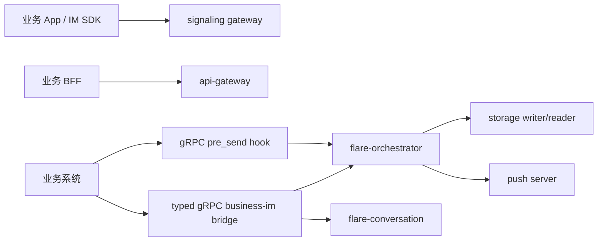
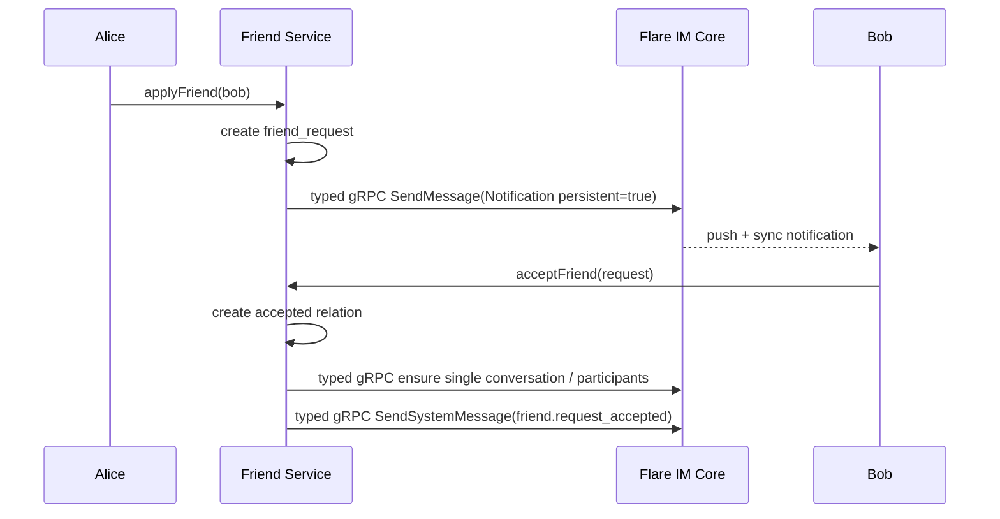
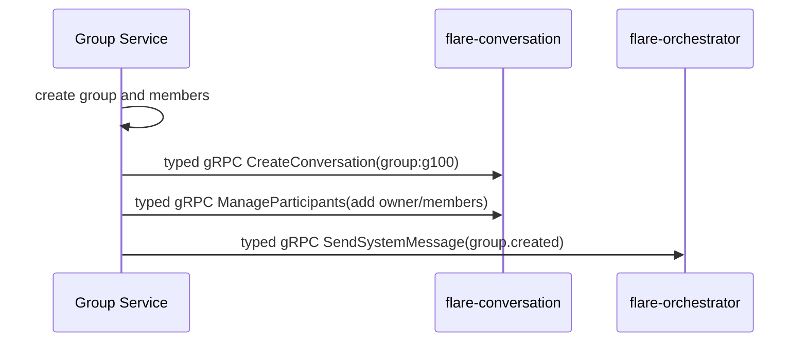
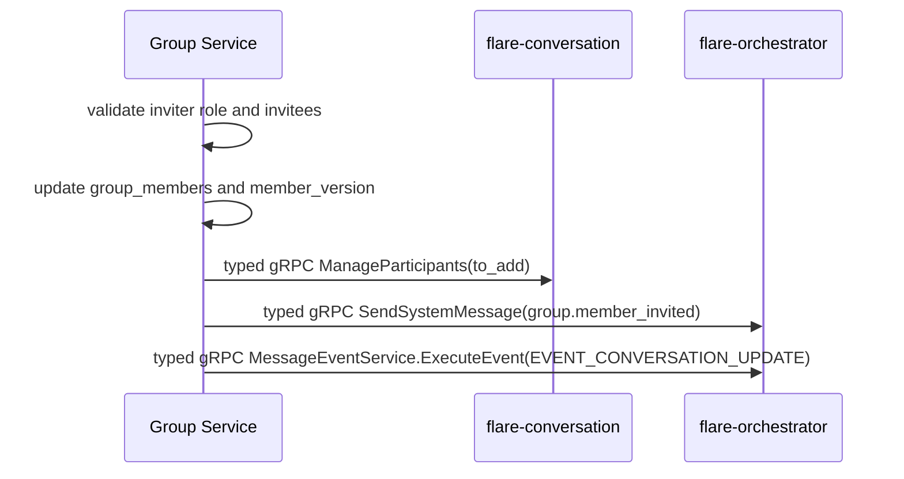

# 业务系统接入示例

本文件说明一个第三方业务系统如何实现用户、好友、群、成员和业务权限，并与 Flare IM Core 交互。原则很简单：业务系统保存业务事实，Core 保存通信事实。

## 领域分工

| 领域 | 业务系统负责 | Flare IM Core 负责 |
|------|--------------|--------------------|
| 用户 | user profile、账号状态、实名、头像、昵称、业务角色 | 消息展示字段可携带 sender_name/avatar，但不作为用户资料源。 |
| 好友 | 好友申请、同意/拒绝、黑名单、陌生人策略 | 单聊会话、消息发送、同步、推送。 |
| 群 | 群资料、群主/管理员、入群审批、邀请、禁言、解散 | 群会话、成员投影、群消息时间线、推送。 |
| 权限 | 谁能给谁发、谁能进群、谁能撤回/踢人 | 通过 Hook/Capability 消费校验结果。 |
| 消息 | 业务消息类型、卡片 payload、业务状态 | `Message`、`Event`、seq、WAL、MQ、存储、sync、push。 |
| 通知 | 什么场景通知、是否持久化、触达策略 | 根据 `NotificationContent.persistent` 进入持久/临时路径。 |

## 推荐架构



业务侧建议拆成：

- Auth Service：签发 token，返回 principal。
- User Service：用户资料。
- Friend Service：好友、黑名单、陌生人策略。
- Group Service：群资料、成员、角色、禁言。
- 业务系统 Hook：推荐 gRPC PreSend Hook，负责主链权限校验。
- 业务系统 IM Bridge：推荐 typed gRPC，把好友/群变更转成 Core 会话、成员、系统消息或事件。

## 推荐 gRPC 接入合同

业务系统生产接入建议把主链能力分成两类：

| 能力 | 推荐方式 | 典型入口 |
|------|----------|----------|
| 发信前权限、黑名单、禁言、风控 | gRPC Hook | `PreSend` Hook，`transport.type = "grpc"` |
| 发送系统消息、业务卡片、业务事件 | typed gRPC | `MessageSendService.SendSystemMessage` / `SendMessage` / `MessageEventService.ExecuteEvent` |
| 撤回、编辑、删除、已读、reaction | typed gRPC | `MessageActionService` |
| 创建会话、同步群成员、更新参与者版本 | typed gRPC | `ConversationManageService` |
| 查询会话、成员、在线状态、媒体引用 | typed gRPC 或 HTTP facade | 高频可信内网用 typed gRPC，外部/后台用 gateway HTTP |

HTTP/OpenAPI 可以作为业务后台、开放平台和低频任务入口；好友/群/权限这类会影响消息主链的能力，不建议长期通过 HTTP Hook 或 HTTP facade 承载高 QPS 调用。

## 用户接入

业务系统保存用户：

```json
{
  "tenant_id": "tenant-1",
  "user_id": "alice",
  "display_name": "Alice",
  "avatar_url": "https://cdn.example.com/a.png",
  "status": "active"
}
```

Core 交互：

1. 用户登录业务系统，业务系统签发 token。
2. 客户端 SDK 用 token 连接 `flare-signaling/gateway`。
3. Gateway 从 token/principal 恢复 `x-user-id`、`x-tenant-id`、`x-device-id`。
4. 在线状态写入 `flare-signaling/online`。
5. 发消息时 Core 使用认证主体作为 sender，不信任客户端自报身份。

消息展示字段：

```json
{
  "sender_id": "alice",
  "sender_name": "Alice",
  "sender_avatar": "https://cdn.example.com/a.png"
}
```

这些字段是展示快照，不是用户资料真源。资料更新由业务系统驱动会话更新或客户端自行刷新。

## 好友接入

业务系统保存好友关系：

```json
{
  "tenant_id": "tenant-1",
  "user_id": "alice",
  "friend_id": "bob",
  "state": "accepted",
  "created_at": 1760000000000
}
```

### 好友申请

推荐流程：



好友申请通知如果需要历史可查，使用：

```text
MessageType = NOTIFICATION
NotificationContent.notification_type = "business.friend_request"
NotificationContent.persistent = true
target_user_ids = ["bob"]
```

如果业务系统自己有可靠站内信列表，只需要在线提示，可以使用 `persistent=false`。

### 单聊发消息权限

PreSend Hook 输入包含 sender、conversation、message。生产环境推荐使用 gRPC Hook。业务 Hook 需要检查：

- sender 是否 active。
- receiver 是否存在。
- 是否为好友。
- 是否被拉黑。
- 是否允许陌生人消息。
- 会话 ID 与 sender/receiver 是否匹配。

伪代码：

```rust
async fn pre_send(ctx: HookContext, draft: MessageDraft) -> HookDecision {
    let tenant_id = ctx.tenant_id();
    let sender_id = ctx.user_id();
    let receiver_id = draft.metadata["receiver_id"].clone();

    if user_is_disabled(tenant_id, sender_id).await {
        return reject("USER_DISABLED");
    }
    if is_blocked(tenant_id, sender_id, &receiver_id).await {
        return reject("BLOCKED");
    }
    if !are_friends(tenant_id, sender_id, &receiver_id).await
        && !allow_stranger_message(tenant_id).await
    {
        return reject("NOT_FRIENDS");
    }
    allow()
}
```

Core 不保存好友关系，只消费 Hook 的 allow/reject。

## 群接入

业务系统保存群资料：

```json
{
  "tenant_id": "tenant-1",
  "group_id": "g100",
  "name": "工程群",
  "owner_id": "alice",
  "status": "active",
  "member_version": 12
}
```

业务系统保存成员：

```json
{
  "tenant_id": "tenant-1",
  "group_id": "g100",
  "user_id": "bob",
  "roles": ["member"],
  "muted_until": null,
  "joined_at": 1760000000000
}
```

Core 会话建议：

```text
conversation_id = "group:g100"
conversation_type = GROUP
channel_id = "g100"
participant_version = group.member_version
```

### 创建群



系统消息：

```text
MessageType = SYSTEM
SystemContent.event_kind = "group.created"
SystemContent.body = "Alice 创建了群聊"
```

### 邀请成员



业务系统负责审批、邀请权限、成员上限。Core 负责成员投影、系统消息、同步和推送。

### 群消息权限

PreSend Hook 推荐通过 gRPC transport 调用，检查：

- 群是否存在且未解散。
- sender 是否成员。
- sender 是否被禁言。
- sender 是否有发指定消息类型的权限。
- message size、媒体 ACL、业务风控。

拒绝示例：

```json
{
  "code": "GROUP_MUTED",
  "message": "你已被禁言"
}
```

### 退群、踢人、解散

| 业务动作 | 业务系统 | Core |
|----------|----------|------|
| 退群 | 删除/标记成员，更新版本 | `ManageParticipants(to_remove)`，发送 `group.member_left` 系统消息。 |
| 踢人 | 校验管理员权限，更新成员 | `ManageParticipants(to_remove)`，发送 `group.member_removed` 系统消息。 |
| 禁言 | 更新成员禁言状态 | 可发送 `EVENT_CONVERSATION_UPDATE` 或系统消息。 |
| 解散 | 群状态改为 dissolved | 发送 `EVENT_CONVERSATION_DELETE` 或系统消息，Hook 后续拒绝发信。 |

## 会话接入

Core 的会话服务保存通信读模型，不替代业务目录。

业务系统在以下场景同步 Core：

- 好友关系建立时，确保单聊会话。
- 群创建时，创建群会话。
- 成员变化时，更新 participants。
- 群名/头像变化时，发送 conversation update。
- 解散/删除时，发送 conversation delete 或更新状态。

### 单聊 conversation_id

推荐确定性生成，保证双方一致：

```text
conversation_id = "single:" + sorted_hash(user_a, user_b)
channel_id = peer_user_id
conversation_type = SINGLE
```

实际生成函数可以由业务系统和 SDK 共享，避免 user A/B 顺序导致两个会话。

### 群聊 conversation_id

推荐：

```text
conversation_id = "group:" + group_id
channel_id = group_id
conversation_type = GROUP
```

## 业务消息示例

### 订单卡片

```json
{
  "message_type": "APP_CARD",
  "app_card": {
    "app_id": "mall",
    "card_type": "order.paid.v1",
    "title": "订单已支付",
    "summary": "订单 order-9 已完成支付",
    "payload": {
      "order_id": "order-9",
      "amount": "99.00"
    }
  }
}
```

交互状态更新可以用 `EVENT_CUSTOM` 或 edit message 更新卡片。

### 红包/转账

```text
MessageType = CUSTOM
CustomContent.type = "payment.red_packet.v1"
CustomContent.payload = {"packet_id":"rp-1","amount":"20.00","currency":"CNY"}
```

业务系统负责余额、领取、防重、风控。Core 只负责消息可靠送达和历史同步。

### 群公告

```text
MessageType = NOTIFICATION
NotificationContent.notification_type = "group.announcement"
NotificationContent.persistent = true
NotificationContent.notify_all = true
```

因为群公告需要历史可查，设置 `persistent=true`。

### 在线弱提醒

```text
MessageType = NOTIFICATION
NotificationContent.notification_type = "typing_hint"
NotificationContent.persistent = false
```

只在线触达，离线丢弃。

## 媒体消息示例

1. 业务或客户端调用 Media API 获取上传 URL。
2. 上传文件到对象存储。
3. 创建媒体引用：

```json
{
  "file_id": "file-1",
  "namespace": "message",
  "owner_id": "alice",
  "business_tag": "chat-image"
}
```

4. 发送图片消息，content 引用 file id。
5. 撤回/删除/过期时更新引用或执行孤儿清理。

## 通知是否持久化的业务选择

| 场景 | 推荐 |
|------|------|
| 好友申请 | `persistent=true`，除非业务系统已有可靠申请列表。 |
| 好友申请红点 | `persistent=false` 或 PushEnvelope，业务列表兜底。 |
| 群邀请 | `persistent=true`。 |
| 管理员公告 | `persistent=true`。 |
| typing | push-only。 |
| 在线状态变化 | push-only 或 presence channel。 |
| 支付结果 | 一般 `persistent=true`，业务系统也应有交易记录。 |
| 风控提示 | 取决于是否需要审计，审计需要持久化。 |

## 业务接入测试用例

最小集成测试建议：

1. 用户登录后连接 SDK，presence 为 online。
2. 好友关系不存在时，PreSend Hook 拒绝单聊。
3. 好友关系存在时，单聊发送成功，双方 sync 可见。
4. 重复 `client_msg_id` 发送只产生一条消息。
5. 群成员不在群内时，PreSend Hook 拒绝群消息。
6. 群成员被禁言时，PreSend Hook 拒绝群消息。
7. 群成员变化后，Core participants 版本更新。
8. `persistent=false` 通知不进入历史查询。
9. `persistent=true` 通知可被 storage reader 查到。
10. storage writer 暂停后恢复，消息最终落库且 ledger 无 failed。

## 常见错误

| 错误 | 后果 | 正确做法 |
|------|------|----------|
| 把好友/群规则写进 Core | Core 业务耦合，后续多业务不可复用 | 使用业务系统 Hook。 |
| 高频业务调用长期走 HTTP facade | 序列化和网关转换增加尾延迟，公开合同也更难表达内部写路径语义 | 可信内网使用 typed gRPC。 |
| 主链权限校验使用 HTTP Hook | 连接管理和 JSON 转换更容易放大尾延迟 | 生产主链使用 gRPC Hook，低频旁路才用 HTTP/Webhook。 |
| 不传 `client_msg_id` | 重试可能产生重复消息 | 业务端稳定生成幂等 ID。 |
| 所有通知都 `persistent=false` | 离线用户收不到重要通知 | 按业务重要性区分。 |
| 群成员变更只改业务库 | Core 推送和 sync 成员读模型过期 | 通过 bridge 同步 participants/conversation event。 |
| Hook 无超时或强依赖慢服务 | 消息发送尾延迟升高 | 主链 Hook 短超时，旁路 Hook ignore/retry。 |
| 用 `attributes` 表达撤回/删除 | 客户端 sync 无法稳定收敛 | 使用 `EventType` 操作事件。 |
