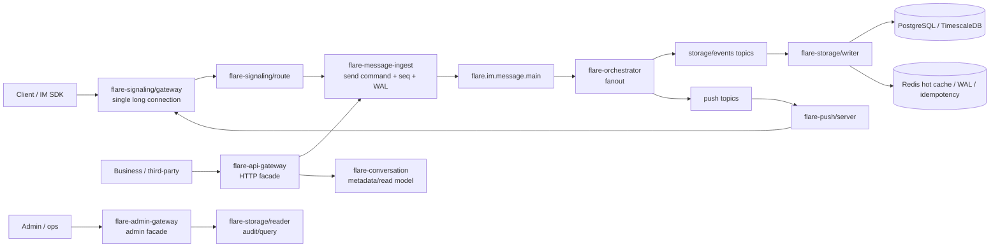

# Core 架构优化落地方案

本文记录针对 `flare-im-core` 网关边界、message ingest、存储选型和统一鉴权的优化方案。目标不是兼容旧本地原型，而是把当前已经拆出的生产主链写硬、写清楚，并继续删除 MongoDB 与旧双写心智。

## 0. 当前落地状态

截至 2026-06-11，已完成第一轮无兼容清理：

- `flare-signaling/gateway` 已使用 `flare-server-core::auth::TokenValidator` 作为长连接认证边界，并校验 token device_id 与连接 device_id。
- `AccessGatewayServiceConfig` 已增加一等 `auth` provider 配置，支持 `core_jwt` 与 `http_hook`；`http_hook` 模式不再要求 Core JWT secret。
- `conversation.ensure` 已改为 protobuf `MqEnvelope(EventCustom)` 投递，conversation consumer 不再解析旧 JSON `EventEnvelope` 或 direct protobuf `Event` payload。
- send path 已增加架构契约测试，要求 conversation 不承载 send/seq，api-gateway 与 signaling route 的消息发送入口收敛到 `flare-message-ingest`。
- `flare-storage` 文档已明确 PostgreSQL / TimescaleDB 是唯一 durable storage database family；MongoDB 不再作为 Core 存储路径。
- `flare-storage/writer` 已抽出 MQ backend failure policy：Kafka 使用 retry topic + DLQ + retry-forwarder，NATS/JetStream 使用 broker-native retry/NACK + DLQ，并由 lib 测试覆盖 ledger ACK failure/retry。
- `flare-im-service-kit` 仍是 6.6K LoC 的共享运行时 God crate，当前同时承载 config、downstream clients、service discovery、gateway auth、runtime bootstrap、health、metrics 和 tracing；需要作为下一轮治理目标拆分。

## 1. 架构方向

目标架构采用一条客户端长连接、一个消息摄入真源、一个持久化数据库族和一个统一鉴权抽象：



核心结论：

- 客户端长连接统一由 `flare-signaling/gateway` 承载，消息、ACK、sync、custom data、call signaling 在连接内逻辑多路复用。
- `flare-api-gateway` 是业务系统和三方 HTTP facade，不再作为客户端 WebSocket 入口。
- `flare-conversation` 不再承担消息发送、seq 分配或通话生命周期，只维护会话元数据、成员、游标、未读和读模型。
- `flare-call` 拥有通话会话业务 FSM；`flare-signaling/gateway` 只处理连接侧信令路由，`flare-capability` / 插件只处理 RTC/SFU 能力编排。
- `flare-message-ingest` 是上行消息写入真源，负责校验、Hook、seq、WAL、conversation ensure 和主消息流发布。
- `flare-storage/writer` 异步消费 MQ，使用 PostgreSQL / TimescaleDB 持久化消息、事件和 ledger。
- MongoDB 不再出现在 Core 持久化路径中；Redis 不是主存储，只做热状态和短期恢复辅助。
- 鉴权统一由 `flare-server-core::auth::TokenValidator` 抽象负责，HTTP 和长连接网关只做传输适配。
- 共享服务脚手架必须从 `flare-im-service-kit` 的宽口径工具箱收敛为小 crate 组合，避免所有服务因为一个 kit 同时依赖 discovery、HTTP auth、metrics、client pool 和 config 解析。

## 2. 取舍分析

### 一条连接还是多条连接

推荐客户端一条主长连接。

优点：

- 客户端生命周期简单，断线重连、设备绑定、心跳、限流和 backpressure 只维护一套。
- 消息、ACK、sync、call signaling 可在同一连接中按 frame 类型隔离，避免两个 WebSocket 入口竞争认证、路由和在线状态。
- 下行推送只需通过 online/route 找到一个 connection owner。

保留例外：

- 音视频媒体流不进入 IM 长连接，走 SFU/WebRTC 自己的媒体通道。
- 业务服务和管理后台继续走 HTTP/gRPC facade，不复用客户端长连接。

### message-ingest 是否独立

推荐保持独立，并把所有 send path 收敛到它。

理由：

- seq 分配、WAL、broker accepted ACK 和幂等属于高吞吐写入链路，不应绑定 conversation metadata 事务。
- conversation 的扩缩容维度是读模型、成员和会话状态，不应被大群消息写入 QPS 拉爆。
- 后续可对 `flare-message-ingest` 独立做限流、队列延迟观测、Redis seq 分片、WAL replay 和压测。

### PostgreSQL + TimescaleDB 是否替代 MongoDB

推荐完全替代。

理由：

- 消息、事件、ledger、审计查询之间有强关系索引需求，PostgreSQL 更适合租户、会话、seq、状态和审计维度。
- TimescaleDB 能处理按时间分区、压缩和冷热历史消息查询。
- 删除 MongoDB 可避免同一份消息写两处导致的分布式事务、补偿和排障复杂度。

边界：

- JSONB 可以承载业务扩展快照，但稳定协议语义必须是 typed proto / enum / columns。
- 大媒体对象仍走 S3 兼容对象存储，数据库只保存元数据和引用关系。

### auth sidecar 还是共享 auth provider

推荐先用共享 auth provider，sidecar 作为部署形态保留。

理由：

- `flare-server-core::auth::TokenValidator` 已经是传输无关抽象，可覆盖 Core JWT、trusted issuer 和 HTTP Hook。
- HTTP gateway 与长连接 gateway 可以复用同一套 validator，不需要先增加独立进程和网络跳转。
- 如果未来需要 Envoy/ext_authz、OPA、SSO 或零信任网格，可以把同一套 provider 包装成 `flare-auth-sidecar`，但 gateway 仍依赖同一个 principal contract。

## 3. 推荐方案

### 服务职责

| 服务 | 保留职责 | 明确禁止 |
|------|----------|----------|
| `flare-signaling/gateway` | 客户端长连接、AUTH frame、心跳、frame 多路复用、连接 metadata、下行投递 | 写消息状态、直接落库、暴露业务 HTTP API |
| `flare-api-gateway` | 业务/三方 HTTP typed facade、认证上下文、错误映射、下游 gRPC 调用 | 客户端 WebSocket、消息持久化、会话事务 |
| `flare-admin-gateway` | 管理面、审计、运维查询、管理员权限 | 客户端接入、业务主链写入 |
| `flare-message-ingest` | send command、幂等、校验、Hook、seq、WAL、conversation ensure、MQ main publish | 会话读模型、存储事务、推送执行 |
| `flare-conversation` | 会话元数据、成员、游标、未读、presence 聚合、conversation ensure 消费 | send message、seq 分配、消息体落库、通话生命周期 FSM |
| `flare-call` | 通话会话生命周期、业务 FSM、通话命令处理 | 长连接路由、媒体/SFU 控制、会话读模型 |
| `flare-im-capability-core` | 能力/插件共享契约、dispatch DTO、guard/resolver/RTC 端口 | 服务运行时、gRPC server、路由登记簿、持久化 |
| `flare-orchestrator` | MQ main 消费、storage/push fanout、操作事件执行、capability enrich | 客户端协议适配、conversation metadata 事务 |
| `flare-storage/writer` | 消息归档、事件流、ledger、热缓存、ACK、retry/DLQ | 路由、实时推送、业务权限 |
| `flare-storage/reader` | 历史消息、事件、ledger、审计查询 | 写入主链、状态变更 |
| `flare-im-service-kit` | 短期过渡 facade，仅保留当前服务启动所需 re-export | 长期拥有 clients/discovery/auth/runtime/metrics 多类关切 |

### `flare-im-service-kit` 拆分目标

当前 `crates/flare-im-service-kit/src` 约 6.6K 行，模块边界如下：

| 关切 | 当前位置 | 目标归属 |
|------|----------|----------|
| 服务运行时计划、配置路径、统一启动 | `runtime.rs`, `health.rs`, `tracing/` | `flare-im-runtime-kit` |
| 全局配置解析、服务配置 DTO、配置管理 | `config/` | `flare-im-config` |
| 服务发现、通道解析、注册中心适配 | `discovery/`, `service_helper.rs` | `flare-im-discovery-kit` |
| 下游 typed gRPC clients | `clients/` | `flare-im-grpc-clients` |
| HTTP gateway settings、principal 注入、auth middleware helper | `gateway/`, `gateway_auth.rs` | `flare-im-gateway-auth` |
| Prometheus 指标对象 | `metrics/` | `flare-im-metrics` |

拆分原则：

- 先抽叶子模块，再抽共享底座：`metrics/tracing/gateway_auth` → `discovery` → `clients` → `config` → `runtime`。
- 新 crate 只暴露一类稳定关切，服务按需依赖，不再通过一个 kit 间接得到全套能力。
- 不保留长期兼容 re-export。迁移期间可以在同一个 PR 内改完所有 workspace member，旧模块随后删除。
- 每次抽取都补一条 arch-test：禁止业务服务通过旧 `flare-im-service-kit` 路径访问已经迁出的关切。
- 拆分完成的退出条件是 `flare-im-service-kit` 删除，或仅保留少于 300 行的 workspace-internal facade 并列入删除计划。

### 消息写入边界

```text
Client / Gateway
  -> flare-message-ingest
  -> Redis WAL when persistent
  -> MQ main with stable idempotency key
  -> broker accepted ACK
  -> flare-orchestrator fanout
  -> storage topic / push topic
  -> storage-writer PostgreSQL transaction
  -> ledger + ACK + sync convergence
```

ACK 语义：

- `TRANSIENT_ACCEPTED`：临时消息只进入实时投递，不承诺存储和离线恢复。
- `BROKER_ACCEPTED`：持久消息默认成功边界，表示 MQ 已接受，存储和推送异步收敛。
- `PERSISTED`：只给确实需要同步落库确认的内部场景，不作为默认发送路径。

### 存储边界

PostgreSQL / TimescaleDB：

- `messages`：消息归档主表，按 `created_at` hypertable。
- `events`：durable event stream，以 `tenant_id + conversation_id + seq` 幂等。
- `message_write_ledger`：写入阶段诊断和最终幂等。
- conversation tables：会话、成员、设置、游标等关系元数据。

Redis：

- seq allocator backend。
- sending/writer WAL。
- hot cache。
- idempotency window。
- presence and short-lived connection state。

MQ：

- main、storage、events、push、retry、DLQ topics。
- 消费者失败通过 nack/retry/DLQ 处理，不回退到同步双写。

## 4. 实施形态

### Phase 0: 边界固化

- 更新文档，删除 MongoDB 存储路径描述。
- 在架构文档写明一条客户端长连接策略。
- 写明 conversation 不承载 send/seq。
- 把 signaling/gateway 认证迁移到 `TokenValidator` 适配层。

### Phase 1: 鉴权配置统一

- 给 `AccessGatewayServiceConfig` 增加与 core/admin 一致的 auth provider 配置。
- 支持 `ACCESS_GATEWAY_AUTH_MODE=core_jwt|http_hook`。
- 长连接 AUTH frame 构造 `TokenValidationRequest`，携带 connection_id、trace_id、device_id、tenant hint。
- 对 token device_id 与连接 device_id 做一致性校验；不一致直接认证失败。

### Phase 2: send path 收敛验证

- 已增加架构契约测试，禁止 conversation 新增 send/seq 职责。
- api-gateway `message/send` 与 signaling route `forward_message` 已通过契约测试守住 `flare-message-ingest` 边界。
- 后续业务 typed gRPC 若新增发送入口，必须复用 `message_ingest_send` / MessageIngest route，不得直连 conversation 或 orchestrator send path。

### Phase 3: PostgreSQL / TimescaleDB 强化

- 确认 `deploy/init.sql` 覆盖 messages、events、ledger、conversation metadata 的索引和 hypertable。
- storage-reader 查询只依赖 PostgreSQL / TimescaleDB 和 Redis cache，不引入第二主存储。
- 写入失败路径标准化为 backend-specific retry/DLQ + ledger error；Kafka 使用 retry topic + DLQ + retry-forwarder，NATS/JetStream 使用 broker-native retry/NACK + DLQ。
- storage-writer retry/DLQ policy 已契约化；ledger ACK failure/retry 测试覆盖。

### Phase 4: 旧 payload 路径清理

- conversation event consumer 已移除旧 JSON `EventEnvelope` 和 direct `Event` payload 分支，只接受 protobuf `MqEnvelope`。
- 删除旧文档、旧配置名和历史 prototype 描述。
- 对 SDK 和平台包确认 ACK durability、sync convergence、pending state 的语义一致。

### Phase 5: `flare-im-service-kit` 拆分

- 建立新 crate：`flare-im-config`、`flare-im-discovery-kit`、`flare-im-grpc-clients`、`flare-im-gateway-auth`、`flare-im-runtime-kit`、`flare-im-metrics`。
- 先迁移无业务状态的 leaf modules：metrics、tracing、gateway auth helper；迁移后更新所有 gateway/import 路径并删除旧模块。
- 迁移 discovery/channel resolver，要求 capability、media、gateway、storage 等服务只依赖 discovery kit，不再把 config/client/runtime 一并拉入。
- 迁移 typed gRPC clients，`flare-api-gateway` 与 `flare-admin-gateway` 只依赖 client crate 和 gateway-auth，不依赖 runtime kit。
- 迁移 `FlareAppConfig` 与 service config DTO 到 config crate；runtime kit 只消费 config crate，不反向持有 discovery/client/auth。
- 最后迁移 `build_service_runtime_plan`、`ImServiceRuntimePlan`、health/tracing glue 到 runtime kit，并删除旧 `flare-im-service-kit` 宽口径 facade。
- 验收：arch-tests 禁止新代码从 `flare-im-service-kit::{clients,discovery,gateway_auth,gateway,metrics}` 导入；workspace check 全绿；服务启动脚本仍按统一 runtime plan 启动。

## 5. 扩展性

- MQ 后端保持 JetStream/Kafka 二选一，同一环境不要双跑同一链路。
- seq allocator 当前可以基于 Redis，未来可按 tenant/conversation shard 拆分。
- auth provider 可以从库内 `TokenValidator` 扩展为 sidecar/mesh ext-authz，但 gateway principal contract 不变。
- capability、RTC/SFU、审核、风控、机器人只通过 Hook/Capability 接入，不成为 Core 必需依赖。
- TimescaleDB 可按租户规模引入 retention/compression policy 和归档导出 worker。
- shared runtime helpers 可按 crate 粒度演进，例如只替换 discovery backend 或 gateway auth provider，不迫使所有服务重编译/重依赖整套 kit。

## 6. 瓶颈与风险

| 风险 | 影响 | 缓解 |
|------|------|------|
| Redis seq 热点 | 超大群或单会话高 QPS 下 Redis key 热 | 分 conversation shard、批量号段、观测 allocator latency。 |
| MQ lag | broker accepted 后存储延迟变大 | 暴露 per topic lag、storage writer consumer lag、ledger stuck rows。 |
| storage writer DB 压力 | 批量写入和索引维护导致尾延迟 | 批量 insert、连接池调优、Timescale compression、冷热分层。 |
| Hook 慢或不可用 | 发送链路尾延迟和失败率上升 | 主链 Hook 短超时、fail-fast、旁路 Hook async retry。 |
| auth provider 不统一 | SSO/JWT 改造需要多处改代码 | 所有 gateway 只依赖 `TokenValidator` 和 principal contract。 |
| 旧 payload 分支重新出现 | 消费者逻辑复杂、误解析、排障困难 | contract/test 固化 protobuf `MqEnvelope` 入口，禁止恢复 JSON/direct payload 分支。 |
| `flare-im-service-kit` 继续膨胀 | 所有服务共享一个高耦合依赖面，改 discovery/auth/config 会牵动全仓 | 按 Phase 5 拆成小 crate，并用 arch-tests 禁止回流。 |
