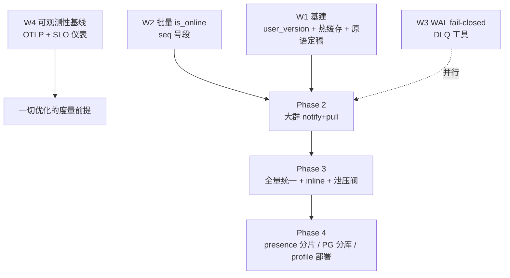

# 亿级演进整体改造规划

本文是 [07-core-architecture-optimization-roadmap.md](07-core-architecture-optimization-roadmap.md) 之后的下一阶段规划：07 解决"边界与职责"，本文解决"规模与投递模型"。规划基于 2026-06 对热路径代码的实测体检（seq 分配、ingest ACK 时序、orchestrator fanout、push 在线查询、sync 协议），围绕三个 IM 核心命题展开：**低延迟、0 丢失、消息同步策略**，并以"统一读扩散内核"为改造主线。

## 0. 目标与验收定义

| 指标 | 目标 |
|------|------|
| 容量 | 1000 万同时在线 / 峰值 50 万 msg/s / 万人群常态化 |
| 上行 ACK 延迟（BROKER_ACCEPTED） | P99 ≤ 50ms（同机房） |
| 端到端投递（单聊，inline 命中） | P99 ≤ 150ms |
| 大群（ping → 拉取应用完成） | P99 ≤ 500ms |
| 同步收敛 | 心跳对账 1 次 RTT 判定"无需同步"（user_version 相等）；冷启动 100 会话 ≤ 2s |

**0 丢失的形式化定义**（验收以此为准，混沌测试按此编写）：

> 任意**单**组件故障（Redis / MQ / PostgreSQL / 任一服务实例）下，已返回 `BROKER_ACCEPTED` 的消息最终必达全部端。唯一允许的丢失窗口 = Redis AOF 刷盘间隔（≤1s）内 ingest 进程崩溃 **且** broker 拒绝的复合故障。

## 1. 体检结论：本规划要解决的问题

正确性骨架已经是亿级的料：seq 权威化（Redis INCR）→ WAL 先行 → broker-accepted ACK → ledger 幂等落库 → 双游标 sync 兜底，四级 `SendAckDurability` 语义明确。瓶颈集中在**扇出侧实现**与**用户级索引缺位**：

| # | 问题 | 证据 | 影响 |
|---|------|------|------|
| 1 | push server 逐收件人**串行** `is_online` gRPC，且每次只查 1 个 user_id（proto 的 `user_ids` 本身是数组）；每用户克隆完整 `push_payload` | `flare-push/server/src/application/handlers/push_router_handler.rs`（message/event/notification 三处循环） | 1000 人群一条消息 = 1000 次串行 RTT + 1000 份 payload 拷贝，push 消费吞吐被钉死 |
| 2 | seq 热路径单条 INCR（每消息 1 次 Redis RTT）；`allocate_batch` 号段能力已实现但未接入 | `crates/flare-im-seq/src/sequence_allocator.rs`、ingest `prepare_and_allocate_seq` | Redis 单分片 ~10w QPS 成为全系统发送 TPS 天花板 |
| 3 | 纯写扩散：ingest 物化 `recipient_user_ids` 进 MqEnvelope | ingest `get_recipient_user_ids` | 万人群信封携带万个 user_id，下行 O(成员数) 信封 |
| 4 | WAL 介质为 Redis，但 Redis 不可用时的行为无契约（fail-closed or 降级？） | ingest WAL 错误分支 | "0 丢失"在故障窗口内语义不明 |
| 5 | DLQ 是终点不是闭环：无重放工具、无 depth 告警 | `*.dlq` topics | 进 DLQ 的消息事实上丢失 |
| 6 | 缺用户级一级游标：跨会话同步靠会话级水位逐一对账 | `user_sync_cursor` 仅存会话维度 | 3000 会话用户的心跳/重连成本高，大群 ping 风暴会放大为多次拉取 |
| 7 | 离线推送 outbox 已持久化但无消费者（厂商通道未接） | `flare-push/worker/src/infrastructure/offline_outbox.rs` | 任务不丢 ≠ 送达 |
| 8 | OTLP 导出缺位（仅 Prometheus + trace_id 贯穿） | service-kit tracing | 无端到端延迟分布，优化无法验证 |

## 2. 改造主线：统一读扩散内核

### 2.1 决策

现状分层拆解：**存储层已是纯读扩散**（消息只按 `conversation_id + conversation_seq` 写一份时间线，无 per-user inbox 副本）；**同步层已是纯读扩散**（双游标 + 快照/增量 + RecoveryHint，拉取是兜底真源）；写扩散只活在**推送层**（per-user payload task）。

结论：**统一到"拉是唯一真源"的读扩散内核，但保留 inline payload 作为优化位**——不是两个模式，而是同一原语上的一个可选字段。由此拿到读扩散的全部架构收益（单链路、瘦信封、过载优雅退化、泄压阀），不付它唯一的代价（单聊 +1 RTT）。

### 2.2 统一投递原语

复用现有 `EventEnvelope` / `window_id` / `PushAck` 机制：

```text
EventEnvelope {
  delivery_mode: PING | PING_WITH_INLINE | INLINE,
  conversation_id,
  min_conversation_seq,        // inline 连续性校验起点；纯 PING 可为 0
  max_conversation_seq,        // 服务端当前水位
  events: [Event...],          // 可选：小会话内联完整事件（= 预取的拉取结果）
  inline_events_truncated,     // true = inline 只是样本/尾部，必须补拉
  window_id                    // 客户端 PushAck/EventStreamAck 的确认窗口
}
```

客户端规则（全部行为）：

1. 收到 `EventEnvelope`，若 `events` 与本地水位**连续衔接**且 `inline_events_truncated=false` → 直接 apply（写扩散的延迟）；
2. 不连续、无 inline，或 `inline_events_truncated=true` → 按区间走现有 `SingleConversationSync` 拉取（读扩散的正确性）；
3. 拉取永远是真源，inline 只是预取。

服务端策略退化为**纯性能参数**（不产生架构分叉，测试矩阵一套）：

| 参数 | 初始值 | 说明 |
|------|--------|------|
| inline 阈值 | 成员数 ≤ 500 | 单聊/小群内联 payload；大群只发 ping |
| ping 防抖窗口 | 200ms / conversation | 连发自动合并为一次 ping |
| 拉取限流 | 租户/用户级令牌桶 | 防登录风暴 × 拉取风暴叠加 |
| inline 总开关 | 全局/租户级，配置热生效 | **过载泄压阀**：关闭 = 全量纯 notify+pull |

边界：typing / presence / 通话信令（`data.proto`，EPHEMERAL 层）**保持纯推**，读扩散只覆盖 durable 会话事件。

### 2.3 前置依赖（硬前提）

1. **user 级 sync 版本号（user_version）**：任何影响"用户可见状态"的变更 → 该用户 `user_version++`（Redis INCR，user 维度，天然可分片）。心跳只带一个版本号；相等则零拉取（99% 心跳就此终结）；落后则先拉"变更过的 conversation_id 列表"（一级索引），再按会话级 seq 增量（二级，现有协议不动）。`SyncSessionHints` 加字段下发，向后兼容。
2. **会话尾部热缓存**：Redis 每会话最近 N 条（初始 50），writer 落库同时写入，reader 优先打缓存。目标命中率 > 95%，保证拉取 QPS 不打 PostgreSQL。
3. ping 防抖 + 拉取限流（上表）。

## 3. 工作流与依赖



- **W1 投递与同步内核**（主线）：读扩散统一、user_version、统一投递原语
- **W2 热路径性能**：批量 is_online、seq 号段、Hook 旁路、route 内嵌
- **W3 可靠性闭环**：WAL fail-closed、DLQ 重放、混沌验证、厂商推送
- **W4 工程治理与形态**：可观测性、profile 部署、service-kit 拆分、契约扩充

## 4. 分阶段计划

### Phase 0：止血与基线（第 1-2 周）

| # | 事项 | 工作流 | 量 | 落点 |
|---|------|--------|----|------|
| 0.1 | push server 批量 `is_online` + 消除 per-user payload 克隆 | W2 | 1 天 | push_router_handler 三处循环；proto 已支持批量 |
| 0.2 | seq 号段接入热路径（ingest 持有每会话号段，耗尽再 INCRBY） | W2 | 2-3 天 | `allocate_batch` 已有 |
| 0.3 | WAL fail-closed 契约：Redis 不可用时持久消息拒发、临时消息降级 TRANSIENT；部署确认 Redis AOF everysec | W3 | 1-2 天 | ingest WAL 错误分支 + arch-tests |
| 0.4 | OTLP 实装（server-core telemetry 一次配置全员生效）+ SLO 仪表：send P99 / broker-accepted / 端到端投递 | W4 | 3-4 天 | flare-core-infra telemetry |
| 0.5 | 工程卫生：工作树分批提交、flare-call 接线收尾、PUSH_ENVELOPE topic 5→1 收尾 | W4 | 2-3 天 | — |

**出口判据**：压测基线报告（单聊 P99、万人群单消息系统行为全记录）；trace 全链贯通可查。

### Phase 1：读扩散基建（第 3-6 周）

| # | 事项 | 要点 |
|---|------|------|
| 1.1 | user_version 落地 | orchestrator fanout 时 INCR + 变更索引（version 区间 → conversation_id 列表）+ hints 下发 + SDK 心跳对账 |
| 1.2 | 会话尾部热缓存 | writer 双写 Redis；reader 旁路；压测命中率 > 95% |
| 1.3 | 统一投递原语定稿 | 设计文档 + proto 字段 + SDK 三规则状态机评审 |
| 1.4 | ping 防抖 + 拉取限流 | 见 §2.2 参数表 |

**出口判据**：user_version 对账走通 SDK e2e；热缓存命中率达标；原语设计评审通过。

### Phase 2：大群读扩散切换（第 7-10 周）

| # | 事项 | 要点 |
|---|------|------|
| 2.1 | ingest 分流：成员数 > N 不物化收件人列表，发会话活跃 ping | N 租户级可配，初始 500 |
| 2.2 | push 链路 ping 通道：只对在线成员发 ping；离线零成本走 user_version 兜底 | 下行 O(成员数) → O(在线成员数) |
| 2.3 | 大群未读模糊化（"99+"）+ @提及/回复精确索引 | 砍大群 per-user 未读维护 |
| 2.4 | 灰度：按租户 → 按会话规模放量；共存期靠 seq 幂等去重 | 回退 = 关分流开关 |
| 2.5 | 【并行 W3】DLQ 重放 CLI（复用 ledger 幂等）+ depth 告警 + 演练 | 0 丢失运维闭环 |

**出口判据**：10 万人大群单消息成本实测 O(在线成员) ping；连发 100 条在 Push Server 解析成员前合并水位，客户端拉取收敛；DLQ 演练通过。

**2026-06-11 实现状态**：

- 大群持久消息实时推送已切到 `EVENT_MESSAGE` pure ping：`flare-orchestrator` 对超过阈值的会话发布 recipient-less `TOPIC_PUSH_EVENTS`，不再在 push 信封中携带物化收件人列表。
- `flare-push/server` 对 recipient-less pure ping 通过 `ConversationReadService.ListConversationParticipants` 分页解析成员，批量过滤在线状态，只对在线用户发布 ping task；离线用户依靠 `user_version` + sync 兜底。
- `flare-push/server` 增加 `event_ping_coalesce_window_ms`，在成员分页前按 `(tenant_id, conversation_id)` 合并大群高频 ping，窗口内保留最高 `max_conversation_seq` 并发送 trailing ping，避免 10 万人大群连发消息按消息数重复扫描成员。
- Conversation 未读写扩散增加 `large_conversation_precise_unread_threshold`，成员数超过阈值时不再逐 participant 增量维护精确 `unread_count`，避免大群消息写放大；@提及精确索引尚未在服务端建模，仍是后续独立索引任务。
- 新增 `flare-dlq-replay` 运维 CLI，可 dry-run 或通过 Kafka/NATS producer 将 JSONL 导出的 DLQ protobuf payload 原样重投，并附加 replay headers。

### Phase 3：全量统一 + 泄压阀（第 11-16 周）

| # | 事项 | 要点 |
|---|------|------|
| 3.1 | 单聊/小群迁入统一原语，开 inline payload | 延迟不回退 |
| 3.2 | 删除旧 per-user payload 推送路径，投递层收敛单链路 | 契约锁"大群信封不得携带收件人列表" |
| 3.3 | 过载泄压阀：全局/租户级关 inline → 纯 notify+pull，配置热生效 | 大促/故障一键降级 |
| 3.4 | Hook 旁路化：PreSend 短超时 fail-fast，审核类移 PostSend 异步 + 撤回补偿 | 在单链路上做，改动面最小 |
| 3.5 | 混沌验证 0 丢失形式化定义（§0） | 杀单组件逐项校验 |

**出口判据**：单聊 P99 ≤ 150ms 保持；关 inline 压测吞吐平稳；混沌全绿；旧路径删除（P2 稳定运行 ≥2 周后）。

**2026-06-11 实现状态**：

- 持久消息的小会话/单聊实时推送已迁入统一 `EventEnvelope` 原语：fanout 将完整 `Message` 作为 `EVENT_MESSAGE` inline payload 发布到 `TOPIC_PUSH_EVENTS`，delivery mode 为 `PING_WITH_INLINE`。
- `MESSAGE_ORCHESTRATOR_INLINE_MESSAGE_PUSH_ENABLED` 作为全局泄压阀已接入；关闭后所有持久消息实时下行退化为 recipient-less pure ping，客户端按 sync 拉取真源。
- 旧 `TOPIC_PUSH_MESSAGES`/`PushMessageRequest` 路径仍保留给非持久/直接推送入口，后续删除需等灰度稳定和客户端能力协商完成。

### Phase 4：规模化与形态（第 17-24 周）

| # | 事项 | 要点 |
|---|------|------|
| 4.1 | presence 下沉：push 直读 Redis presence，去 gRPC 问询；online 按 user hash 分片设计 | 33w op/s 心跳承接 |
| 4.2 | route 内嵌 gateway（库化），上行 -1 跳 | route 无独立状态 |
| 4.3 | PG 演进：writer 批量 insert 调优 + Timescale retention/compression 上线 + 分库设计稿（conversation_id hash） | ledger 幂等键天然支持 |
| 4.4 | 离线推送厂商通道：FCM 先行（outbox 消费者），per-tenant 凭据进 tenants 表 | 闭环 outbox |
| 4.5 | 部署 profile 化：flare-im-all 聚合 bin（dev 单进程 / standard 三组分 / full 全拆） | `RuntimeShutdownSignals` 已就位 |
| 4.6 | 治理收尾：service-kit 拆分、env 注册表、must-be-used 断言、panic_boundary 扩圈（下一个 ingest）、proto 删废弃信封 | 还旧债 |

**出口判据**：standard profile 三进程跑通全量 e2e；50 万 msg/s 压测达标报告。

**2026-06-11 实现状态**：

- Push Server 在线过滤支持 `online_status_backend = "redis"`，直接批量读取 signaling-online 维护的 `session:{user_id}` 哈希，避免每批 push 再经 online gRPC；`grpc` 后端保留为回退。

## 5. 贯穿性验证体系（每阶段三道门）

**契约门（arch-tests 新增）**：

- WAL fail-closed 行为契约（Phase 0）
- 大群信封禁带收件人列表（Phase 2）
- 核心 crate must-be-used 断言（防"建而不接"空窗）
- 投递层单链路：旧 push 路径不得复活（Phase 3 后）

**压测门（固定场景集，每阶段回归）**：单聊乒乓延迟 / 万人群单消息风暴 / 连发 100 条合并率 / 登录风暴（10 万设备冷同步）/ 关 inline 退化测试。

**混沌门**：杀单组件验证 0 丢失定义；网络分区下 `SyncRecoveryHint` 行为；DLQ 注入与重放。

## 6. 容量推演参考（1 亿注册 / 1000 万在线 / 50 万 msg/s）

| 组件 | 压力 | 结论 |
|------|------|------|
| Gateway | 1000 万长连接 | 单机 10-20 万连接 → 50-100 台；补优雅排水协议 |
| Seq | 50 万 INCR/s | 号段化后单分片即可；超热会话按 conversation hash 分片 |
| MQ main | 50 万 msg/s | Kafka 无压力；JetStream 需实测；补 per-topic lag 看板 |
| Push fanout | ×10 收件人 | 批量 + 读扩散后从 500 万 task/s 回到 ~50 万/s 量级 |
| Presence | 33 万 op/s 心跳 | online 分片 + push 直读（Phase 4.1） |
| PG 写入 | 50 万行/s | 批量 insert + Timescale 压缩 → 终态分库（Phase 4.3 设计稿） |

## 7. 风险与回退

| 风险 | 缓解 |
|------|------|
| 双路径共存期重复投递 | seq 幂等去重已有；灰度按租户隔离爆炸半径 |
| 拉取风暴打穿 reader | 热缓存为 Phase 1 硬前提 + 令牌桶；泄压阀反向兜底 |
| user_version INCR 新热点 | user 维度天然分片；必要时同样号段化 |
| SDK 升级节奏滞后 | 原语向后兼容：老客户端继续收全量推，服务端按客户端能力位协商 |
| 阶段回退 | Phase 0-2 全开关化（回退 = 关开关）；Phase 3 删旧路径前 P2 须稳定运行 ≥2 周 |

## 8. 里程碑总览

```text
周  1-2   Phase 0  止血 + 基线   → 基线报告 / trace 贯通
周  3-6   Phase 1  读扩散基建    → user_version / 热缓存 / 原语定稿
周  7-10  Phase 2  大群切换      → 万人群成本降一个数量级 / DLQ 闭环
周 11-16  Phase 3  全量统一      → 单链路 + 泄压阀 + 混沌全绿
周 17-24  Phase 4  规模化形态    → 50w msg/s 达标 + 三进程 profile
```

**取舍逻辑收束**：Phase 0 用最小代价捡回"实现粗糙"的钱；Phase 1-3 把投递层从"写扩散实现 + 读扩散兜底"改造成"读扩散内核 + 推送优化位"，正确性收敛到一条被契约和混沌验证的链路；Phase 4 才做水平扩展——前三阶段已把单位消息成本降一个数量级，扩容数字将完全不同。
