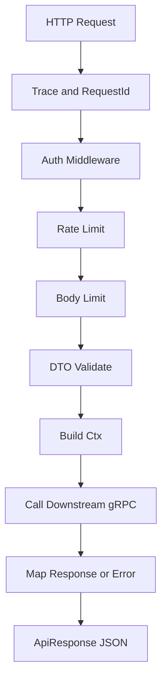

# flare-api-gateway 网关能力规范

## 1. 定位

`flare-api-gateway` 是 Core 对 HTTP 客户端、管理后台和业务 BFF 暴露能力的统一入口。它不承载 IM 领域状态，不直接写消息/会话存储，只负责：

- HTTP/JSON 与内部 gRPC 的协议适配。
- 调用下沉认证 provider 恢复可信身份，完成租户、trace、request 上下文透传。
- 统一错误映射和返回格式。
- 请求限流、超时、审计、OpenAPI 文档。
- 面向管理面和非实时能力暴露 REST API。

实时消息上下行仍以 SDK 长连接为主；HTTP `SendMessage` 只适合后台、机器人、管理面或特定业务系统低频调用。业务系统在可信内网接入 Core 的高频写路径时，推荐使用 typed gRPC；业务规则主链扩展推荐使用 gRPC Hook。

## 2. 能力边界

| 能力 | 网关职责 | 下游服务 |
|------|----------|----------|
| 消息发送/操作 | 参数校验、身份注入、gRPC 转发 | `MessageSendService` / `MessageActionService` |
| 会话查询 | 查询参数规范化、分页/游标透传 | `ConversationReadService` |
| 媒体上传/处理 | HTTP 上传、预签名、引用管理 | `MediaService` |
| 同步入口 | 可选暴露非实时 Sync API | `SyncService` |
| Capability 管理 | 能力查询、授权、Dispatch 管理面 | `CapabilityService` |
| 业务系统聚合 | 只做 BFF 编排，不把业务系统逻辑写入 Core | 业务系统 Gateway 或业务系统 typed gRPC |

禁止：

- 在 gateway 内写消息顺序、未读数、好友关系、群权限等业务规则。
- 在 gateway 中绕过 orchestrator 直接写 storage。
- 在 HTTP 请求体中信任 `user_id`、`tenant_id` 作为权威身份。
- 在 gateway 中签发、刷新、撤销或存储 token。

## 3. 路由规范

统一前缀：`/api/v1`。

| 路由 | 方法 | 说明 | 认证 |
|------|------|------|------|
| `/api/v1/messages/send` | POST | HTTP 发消息，内部转 `SendMessage` | 必须 |
| `/api/v1/messages/recall` | POST | 撤回消息 | 必须 |
| `/api/v1/messages/read` | POST | 标记已读 | 必须 |
| `/api/v1/conversations` | GET | 会话列表/摘要 | 必须 |
| `/api/v1/conversations/participants` | GET | 分页读取会话参与者 | 必须 |
| `/api/v1/conversations/participants/manage` | POST | 管理会话参与者，供后台/业务 bridge 使用 | 管理权限 |
| `/api/v1/medias/*` | GET/POST/DELETE | 媒体能力 | 除公开下载外必须 |
| `/api/v1/capabilities/*` | GET/POST | 能力管理面，后续补齐 | 管理权限 |
| `/api/v1/admin/*` | GET/POST/PATCH/DELETE | 管理后台、运维、审计接口 | 管理主体 |
| `/health` | GET | 存活检查 | 不需要 |
| `/api-doc/openapi.json` | GET | OpenAPI | 可按环境关闭 |

REST 命名规则：

- 资源用复数名词：`messages`、`conversations`、`medias`。
- 命令型操作可用动词子路径：`/messages/recall`、`/uploads/complete`。
- 列表接口必须使用 cursor 或明确分页对象，超大列表禁止裸 offset。
- 幂等写请求必须支持 `Idempotency-Key` 或 `x-request-id`。

## 4. 安全认证

### 4.1 入站认证

网关从请求中提取认证材料，但具体 token 校验、刷新、撤销、会话存储必须下沉到 `flare-server-core` auth provider 或业务认证系统。Gateway 只消费标准 principal，不拥有 token 生命周期。

网关从以下来源恢复上下文：

| 来源 | 用途 |
|------|------|
| `Authorization: Bearer <token>` | 用户身份与权限 |
| `x-tenant-id` | 租户路由，可由 token 校验覆盖 |
| `x-request-id` | 幂等与排障；不存在则生成 |
| `x-trace-id` | 链路追踪；不存在则生成 |
| `x-device-id` | 设备维度风控与审计 |
| `x-app-id` | 开放平台 / ISV 应用 |

认证要求：

- token 校验通过后，`user_id`、`tenant_id` 以 token claims 为准。
- 请求体中的 `user_id` 只能作为业务参数，不能覆盖认证身份。
- 管理面 API 必须校验下沉认证 provider 返回的 Admin scope；业务管理员、角色和审批由业务系统自行实现。
- 服务间调用使用 mTLS 或内网服务 token，不能复用普通用户 JWT。
- 当前 `core_jwt` claims 不携带 scopes，因此默认不能访问 Admin API；业务端应通过 `http_hook` 或共享 `flare-server-core::auth` provider 返回 `core_gateway:admin` / `core_gateway:admin:*`。
- Admin 写操作必须透传 `x-actor-id`、`x-audit-reason` 和 `x-request-id` / `Idempotency-Key`，并由下游服务记录审计事件。
- 不建议配置 `ADMIN_SECRET` 直接放行 Gateway Admin API；密钥应放在业务 auth provider、hook secret、JWT issuer 或 mTLS 层。
- Admin 接入前可调用 `GET /api/v1/admin/capabilities` 发现所需 scope、header、安全边界和当前可用 endpoint。
- Admin 只读运维面已提供 `GET /api/v1/admin/gateway/health`、`/upstreams`、`/routes`、`/config`；这些接口返回 Gateway 本地快照，不主动探测下游，`/config` 必须脱敏。
- Admin 消息查询已提供 `POST /api/v1/admin/messages/query`、`GET /api/v1/admin/messages/{message_id}`、`GET /api/v1/admin/messages/{message_id}/events` 和 `POST /api/v1/admin/messages/export`，通过 typed HTTP facade 调用 storage-reader；Gateway 要求查询/导出具备明确边界，并将分页 `limit` 限制在 500 以内。

### 4.2 出站 gRPC metadata

所有下游 gRPC 请求必须注入：

| metadata | 必填 | 说明 |
|----------|------|------|
| `x-trace-id` | 是 | 链路追踪 |
| `x-request-id` | 是 | 幂等和日志关联 |
| `x-tenant-id` | 是 | 租户隔离 |
| `x-user-id` | 用户请求必填 | 操作用户 |
| `x-actor-id` | 管理/代操作建议 | 实际执行主体 |
| `x-app-id` | 开放平台请求建议 | 应用身份 |
| `x-audit-reason` | 管理写操作建议 | 审计原因 |

## 5. 统一返回格式

所有 JSON API 返回 `ApiResponse<T>`：

```json
{
  "code": 0,
  "data": {},
  "reason": null,
  "message": null,
  "track": "trace-id"
}
```

字段语义：

| 字段 | 说明 |
|------|------|
| `code` | `0` 表示成功；错误时使用 `ErrorCode` 数值 |
| `data` | 成功响应数据 |
| `reason` | 机器可读错误原因 |
| `message` | 人类可读错误说明 |
| `track` | `trace_id` 或错误追踪 ID |

HTTP status 与业务 `code` 同时存在：

| HTTP status | 使用场景 |
|-------------|----------|
| `200` | 业务成功 |
| `400` | 请求参数错误、JSON 解码失败 |
| `401` | 未认证或 token 无效 |
| `403` | 已认证但无权限 |
| `404` | 资源不存在 |
| `409` | 幂等冲突、状态冲突 |
| `422` | 语义校验失败 |
| `429` | 限流 |
| `502` | 下游 gRPC 错误 |
| `503` | 下游不可用 |
| `504` | 下游超时 |

## 6. 错误映射

gRPC status 到 HTTP 的推荐映射：

| gRPC Code | HTTP | reason |
|-----------|------|--------|
| `InvalidArgument` | 400 | `INVALID_ARGUMENT` |
| `Unauthenticated` | 401 | `UNAUTHENTICATED` |
| `PermissionDenied` | 403 | `PERMISSION_DENIED` |
| `NotFound` | 404 | `NOT_FOUND` |
| `AlreadyExists` | 409 | `ALREADY_EXISTS` |
| `FailedPrecondition` | 409 | `FAILED_PRECONDITION` |
| `ResourceExhausted` | 429 | `RESOURCE_EXHAUSTED` |
| `Unavailable` | 503 | `UPSTREAM_UNAVAILABLE` |
| `DeadlineExceeded` | 504 | `UPSTREAM_TIMEOUT` |
| `Internal` / unknown | 502 | `GRPC_ERROR` |

业务拒绝，例如业务系统 `pre_send` 拒绝，应由 orchestrator 转为明确业务错误，gateway 再映射为 `403` 或 `422`，不能简单暴露为 `502`。

## 7. 请求处理流水线



每个 Handler 只做：

1. 解析 HTTP 参数。
2. 校验 DTO。
3. 从认证上下文构建 `Ctx`。
4. 转换为 gRPC request。
5. 调用 client。
6. 转换为 `ApiResponse<T>`。

## 8. 超时、重试与限流

| 项 | 建议 |
|----|------|
| HTTP 请求超时 | 默认 30s，消息/会话接口建议 3-5s |
| gRPC connect timeout | 默认 5s |
| gRPC request timeout | 消息 1-3s，媒体处理按任务化拆分 |
| 重试 | 只对幂等读和明确幂等写重试 |
| 限流维度 | tenant、user、IP、route、app_id |
| 大请求体 | 媒体走分片或预签名上传，普通 JSON 限制较小 |

消息发送接口重试必须依赖 `client_message_id` 或 `x-request-id` 去重，不能盲目重试造成重复消息。

## 9. 观测与审计

日志字段必须包含：

- `trace_id`
- `request_id`
- `tenant_id`
- `user_id`
- `route`
- `method`
- `grpc_service`
- `grpc_method`
- `status`
- `latency_ms`
- `error_code`

指标建议：

- `gateway_http_requests_total`
- `gateway_http_request_duration_ms`
- `gateway_grpc_requests_total`
- `gateway_grpc_request_duration_ms`
- `gateway_auth_failures_total`
- `gateway_rate_limited_total`
- `gateway_upstream_errors_total`

审计事件：

- 管理面 capability 授权变更。
- 消息撤回、删除、强制下线等敏感操作。
- 媒体硬删除、ACL 变更。

## 10. 落地状态与后续顺序

已落地：

- `Ctx::from_headers` 读取 `x-request-id`，并在出站 metadata 注入。
- `GrpcClients` 接入 `MessageSendService` / `MessageActionService` typed client。
- message send / recall / mark-read handler 已转为真实 gRPC 代理调用。
- `GrpcClients` 接入 `ConversationReadService` / `ConversationManageService` typed client。
- conversation list / participant list / participant manage 已转为真实 gRPC 代理调用。
- presence 查询和登出入口已接入 Signaling Online typed client。

后续顺序：

1. 把 gateway 内认证实现进一步下沉到共享 auth provider，gateway 只依赖 principal 合同。
2. 细化 `tonic::Status` 到 `GatewayError` 的映射。
3. 为所有 Handler 增加 DTO validation。
4. 给 OpenAPI 增加 public/admin 分组、统一 security scheme 和 `ApiResponse` schema。
5. 接入统一 metrics 和 request body limit。
6. 接入 storage reader / sync / capability typed proxy，并补齐 conversation detail/update 等管理接口。
7. 按 [`ADMIN_AND_THIRD_PARTY_API.md`](./ADMIN_AND_THIRD_PARTY_API.md) 补齐 Admin API 与三方 gRPC facade。

Rust/gRPC typed proxy 的模块设计、channel 策略、message 代理映射和后续接入路线见 [`GRPC_PROXY_DESIGN.md`](./GRPC_PROXY_DESIGN.md)。
