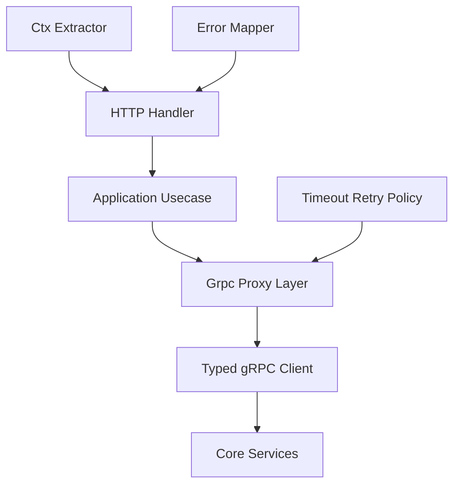

# flare-api-gateway Rust/gRPC 代理设计

## 1. 目标

`flare-api-gateway` 的代理层要成为 API Gateway 与内部 gRPC 服务之间的稳定边界。它不是简单转发器，而是统一处理：

- Rust 类型安全的 HTTP DTO 到 gRPC Request 转换。
- `Ctx`、认证身份、租户、trace、request_id 透传。
- 下游服务发现、channel 生命周期、超时、错误映射。
- HTTP REST、管理面 API、机器人/后台 API 的统一出口。
- 后续可选的 gRPC facade / BFF orchestration 能力。

Gateway 保持轻量：gRPC 代理层只做 typed client、metadata、错误和策略适配，不承载 token 生命周期，也不实现 IM 领域规则。

接入策略上，可信内网的业务系统高频调用推荐直接使用 typed gRPC；Gateway HTTP facade 面向外部三方、后台和低频任务。业务规则主链扩展推荐 gRPC Hook，不建议用 HTTP/Webhook 承载高 QPS 权限校验。

## 2. 分层设计



推荐模块边界：

| 模块 | 职责 |
|------|------|
| `interface/http` | HTTP 路由、DTO 解析、OpenAPI 注解，不写业务规则 |
| `application` | 用例编排、请求校验、DTO 到命令转换 |
| `infrastructure/grpc` | Typed client、channel、metadata、错误映射、重试 |
| `context` | HTTP header 到 `Ctx`，以及 gRPC metadata 注入 |
| `error` | `tonic::Status` / domain error 到 `GatewayError` / `ApiResponse` |

当前已落地的基础：

- `Ctx` 读取并透传 `x-trace-id`、`x-request-id`、`x-tenant-id`、`x-user-id`。
- `GrpcClients` 聚合 `MediaService`、`MessageSendService`、`MessageActionService`、`ConversationReadService`、`ConversationManageService`。
- Message HTTP API 通过 typed gRPC client 代理到 Orchestrator。
- Conversation HTTP API 已接入列表、参与者分页和参与者变更代理。

## 3. gRPC Proxy 类型

### 3.1 Typed Proxy

Typed Proxy 是默认方案，每个 Core 服务一个 wrapper：

| Wrapper | 下游服务 | 状态 |
|---------|----------|------|
| `MediaServiceClientWrapper` | `MediaService` | 已有 |
| `MessageSendServiceClientWrapper` | `MessageSendService` | 已接入 |
| `MessageEventServiceClientWrapper` | `MessageEventService` | 已接入 |
| `MessageActionServiceClientWrapper` | `MessageActionService` | 已接入 |
| `ConversationReadServiceClientWrapper` | `ConversationReadService` | 已接入 |
| `ConversationManageServiceClientWrapper` | `ConversationManageService` | 已接入参与者变更 |
| `SyncServiceClientWrapper` | `SyncService` | 待接入 |
| `CapabilityServiceClientWrapper` | `CapabilityService` | 待接入 |

Typed Proxy 适合业务 API，因为它能做字段校验、版本兼容和稳定错误映射。

### 3.2 Generic Proxy

Generic Proxy 只用于内部调试或管理面，不建议对公网开放：

- 输入：目标 service、method、protobuf bytes 或 JSON transcoding。
- 输出：原始 bytes 或 JSON。
- 必须限制 allowlist，禁止任意 method 代理。
- 必须记录审计日志。

Generic Proxy 适合：

- 管理后台调试 capability。
- 灰度新 proto 前的内部验证。
- 运维工具访问只读 gRPC。

### 3.3 Third-party gRPC Facade

外部三方默认使用 HTTP OpenAPI。确实需要 gRPC 时，应新增版本化 facade，而不是直接暴露内部 service：

| facade | 目标用户 | 能力 |
|--------|----------|------|
| `ApiGatewayPublicService` | 可信业务服务、机器人、BFF | 发消息、撤回、会话查询、媒体查询、在线查询 |
| `ApiGatewayAdminService` | 管理后台、运维工具 | 消息查询/导出、设备管理、能力管理、审计查询 |

Facade 规则：

- 使用公开 proto 包名，例如 `flare.api_gateway.v1`。
- 只暴露可长期承诺的字段和错误，不直接透出所有内部 proto。
- metadata 与 HTTP header 保持同名语义：`x-tenant-id`、`x-user-id`、`x-actor-id`、`x-request-id`、`x-trace-id`。
- Admin facade 必须有 service token/mTLS、allowlist、审计和限流。
- 不允许通过 facade 绕过 orchestrator、storage writer 或 capability 校验。

## 4. Channel 与服务发现

生产建议支持两种 endpoint：

| endpoint | 说明 |
|----------|------|
| `http://host:port` | 本地开发、静态部署 |
| `discovery://service-name` | Consul/etcd 服务发现 |

Channel 策略：

- 每个下游服务维护一个长生命周期 `Channel`，不要每次请求新建连接。
- channel 建立失败时启动失败；后续断链由 tonic reconnect / lazy connect 处理。
- wrapper 内不要持有全局业务状态。
- 高 QPS 下避免在长时间流式请求期间持有全局 mutex；流式能力应拆出独立 client clone。

后续建议将 `Arc<Mutex<ClientWrapper>>` 演进为：

```rust
pub struct GrpcService<T> {
    client: T,
    policy: GrpcProxyPolicy,
}
```

tonic client clone 成本低，可在每个请求 clone client，减少 mutex 竞争。

## 5. 上下文透传

入站 HTTP header：

| header | 来源 |
|--------|------|
| `Authorization` | 用户或服务身份 |
| `x-trace-id` | 客户端或网关生成 |
| `x-request-id` | 幂等键；不存在则网关生成 |
| `x-tenant-id` | 租户 |
| `x-user-id` | 认证中间件注入 |
| `x-device-id` | 设备 |
| `x-app-id` | 开放平台应用 |
| `x-actor-id` | 管理或代操作主体 |
| `x-audit-reason` | 管理写操作原因 |

出站 gRPC metadata 必须包含：

| metadata | 说明 |
|----------|------|
| `x-trace-id` | 全链路追踪 |
| `x-request-id` | 幂等和日志关联 |
| `x-tenant-id` | 多租户隔离 |
| `x-user-id` | 操作用户 |
| `x-actor-id` | 管理或代操作主体 |
| `x-audit-reason` | 审计原因 |

对于管理面代操作，应增加 `x-actor-id`，区分实际管理员与被操作用户。

## 6. 错误映射

网关内部统一使用 `GatewayError`，对外统一 `ApiResponse<T>`。

gRPC 错误映射推荐：

| tonic status | HTTP | reason |
|--------------|------|--------|
| `InvalidArgument` | 400 | `INVALID_ARGUMENT` |
| `Unauthenticated` | 401 | `UNAUTHENTICATED` |
| `PermissionDenied` | 403 | `PERMISSION_DENIED` |
| `NotFound` | 404 | `NOT_FOUND` |
| `AlreadyExists` | 409 | `ALREADY_EXISTS` |
| `FailedPrecondition` | 409 | `FAILED_PRECONDITION` |
| `ResourceExhausted` | 429 | `RESOURCE_EXHAUSTED` |
| `Unavailable` | 503 | `UPSTREAM_UNAVAILABLE` |
| `DeadlineExceeded` | 504 | `UPSTREAM_TIMEOUT` |
| other | 502 | `GRPC_ERROR` |

原则：

- 下游业务拒绝不能统一变成 `502`。
- `pre_send` 被业务系统拒绝应透出明确业务 reason，例如 `BUSINESS_PRESEND_DENIED`。
- 错误响应必须带 `track`，对应 trace 或 request id。

## 7. 超时、重试、幂等

| API 类型 | 超时 | 重试 |
|----------|------|------|
| 发消息 | 1-3s | 仅在 `client_msg_id` / `x-request-id` 幂等时允许 |
| 撤回/删除 | 1-3s | 默认不自动重试 |
| 会话查询 | 1-2s | 可重试一次 |
| 媒体预签名 | 2-5s | 可重试 |
| 媒体处理 | 返回 task_id，避免同步长等 |
| Capability Dispatch | 按能力配置，默认短超时 |

写请求幂等键优先级：

1. HTTP `Idempotency-Key`
2. `x-request-id`
3. 业务字段，如 `client_msg_id`

## 8. Message 代理规范

HTTP `POST /api/v1/messages/send` 到 gRPC `SendMessage` 的转换：

| HTTP 字段 | gRPC 字段 |
|-----------|-----------|
| `conversation_id` | `SendMessageRequest.conversation_id` / `Message.conversation_id` |
| `message_type` | `Message.message_type` |
| `content` | `Message.content` |
| `client_msg_id` | `Message.client_msg_id` |
| `channel_id` | `Message.channel_id` |
| `sync` | `SendMessageRequest.sync` |
| `svid` | `SendMessageRequest.svid` |
| authenticated user | `Message.sender_id` |

生产推荐：

- SDK 仍使用 protobuf `MessageContent` 编码。
- HTTP API 可保留 JSON 透明代理能力，但应在 `extra.content_format = json` 或版本字段中标识。
- 服务端校验 `conversation_type`、`channel_id`，单聊必须有对端 ID。
- 发消息前会触发 Orchestrator `pre_send` Hook，包括业务系统权限校验。

## 9. Conversation / Sync / Capability 代理路线

下一阶段应按以下顺序接入：

1. `ConversationReadService`：继续补齐会话详情。
2. `MessageActionService`：补齐编辑、删除、reaction、pin、mark/unmark。
3. `SyncService`：暴露管理/测试用同步入口，客户端仍优先 SDK。
4. `CapabilityService`：能力列表、授权管理、Dispatch。
5. `ConversationManageService`：继续补齐 update/read/force sync 等管理接口，必须强权限和审计。

## 9.1 Admin API 与 gRPC 对齐路线

Admin API 必须先以 typed HTTP proxy 落地，再按需要暴露 gRPC facade。映射关系见 [`ADMIN_AND_THIRD_PARTY_API.md`](./ADMIN_AND_THIRD_PARTY_API.md)。

| Admin 能力 | HTTP 前缀 | gRPC facade | 下游 |
|------------|-----------|-------------|------|
| 消息查询/导出 | `/api/v1/admin/messages` | `ApiGatewayAdminService.QueryMessages/ExportMessages` | `StorageReaderService` |
| 会话管理 | `/api/v1/admin/conversations` | `ApiGatewayAdminService.GetConversationDetail/ManageParticipants` | `ConversationReadService` / `ConversationManageService` |
| 媒体管理 | `/api/v1/admin/media` | `ApiGatewayAdminService.GetFileInfo/DeleteFile` | `MediaService` |
| 在线设备 | `/api/v1/admin/presence` | `ApiGatewayAdminService.ListUserDevices/KickDevice` | `OnlineService` |
| 能力插件 | `/api/v1/admin/capabilities` | `ApiGatewayAdminService.ListCapabilities/GrantUserCapability` | `CapabilityService` |

## 10. Rust 实现要求

- 禁止在 handler 中直接拼接 SQL 或访问存储。
- 禁止 `unwrap()` / `panic!()`。
- 所有下游调用必须带 `Ctx`。
- 所有 handler 必须有结构化日志，至少包含 `trace_id`、`request_id`、route、下游 service。
- DTO 转换逻辑复杂时下沉到 `application`，handler 保持薄。
- 流式上传/下载不得长时间持有全局 client mutex；必要时 clone tonic client。

## 11. 演进任务

| 优先级 | 任务 |
|--------|------|
| P0 | 细化 `tonic::Status` 到 `GatewayError` 的错误映射 |
| P0 | conversation detail / update / mark-read 真实 gRPC 代理 |
| P1 | gateway 级 `GrpcProxyPolicy`：timeout、retry、body limit、rate limit |
| P1 | OpenAPI security scheme 与统一错误 schema |
| P1 | Capability 管理 API |
| P1 | Admin API 使用文档与公开/管理分组 |
| P2 | gRPC facade，仅暴露稳定 public/admin 子集 |
| P2 | Generic gRPC proxy，仅内部 allowlist |
| P2 | metrics、audit log、admin operation trail |
